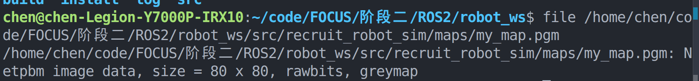
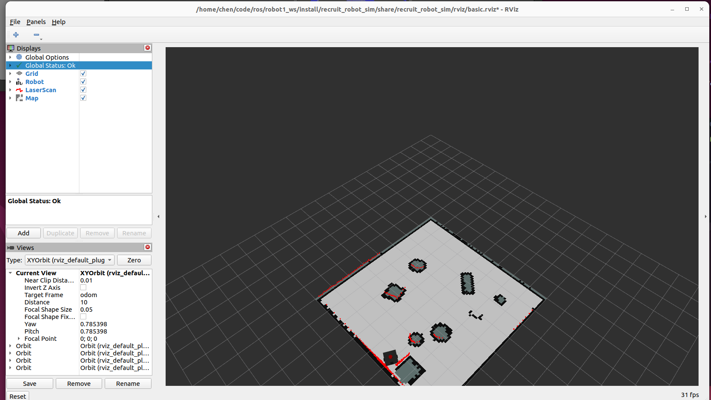
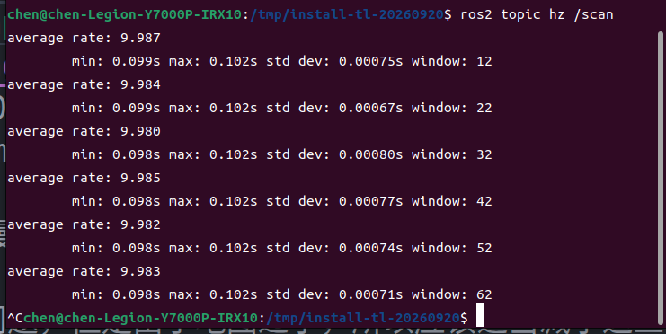

# ROS 2 Robot Recruitment Project

The Gazebo recruitment starter package is [recruit_robot_sim](recruit_robot_sim/README.md). It provides manual driving, LiDAR, odometry, TF, RGB camera, RViz, and SLAM Toolbox for students to build their own simple autonomous mapping and OpenCV colour-following programs.

See the package README for installation, build, launch, topic checks, and the staged recruitment tasks.

# TASK1--项目环境说明
项目采用Ubuntu22.04配合gazebo11.10.2进行开发

# 关键安装
sudo apt update && sudo apt install -y gazebo libgazebo-dev ros-humble-gazebo-ros-pkgs ros-humble-gazebo-ros2-control

## 简单介绍对环境的初步认识
通过
ros2 topic list查看所有话题
ros2 topic info -v 具体话题查看话题具体信息
ros2 interface show 接口 查看接口信息(方便后续通过话题通信进行进一步访问与修改操作)

## tf树结构的查看

# 环境正常工作查看
启动脚本正常运行：
[text](attachments/视频/第一天bringup_启动视频.webm)
相机图片的查看：

# TASK2:设计机器人仿真环境与重够机器人模型
## 新建一个红色圆柱体并进行参数调节

## 尝试修改机器人模型
机器人结构进过观察，未发现值得修改的点，后续根据需求再修改模型

# TASK3:手动控制与 SLAM 建图
## 安装建图相关库
`sudo apt install ros-$ROS_DISTRO-slam-toolbox`

## 建图并保存
`ros2 run nav2_map_server map_saver_cli -f my_map`

## 建图结果

[tips]最开始路径书写错误
使用`ros2 run nav2_map_server map_saver_cli -f /maps/my_map`
错音：写相对路径时，最开头不能带有/这个表示将文件放置到根目录中，与我本意使用相对路径保存不符

# TASK4:SLAM参数调节与对比

从这个建图过程以及最终结果分析：
## 问题罗列与现象记录
### 1. 边缘扭曲
    现象：边缘面上出现黑白参差的情况。
    出现位置：地图外轮廓边缘。

### 2. 地图刷新滞后
    现象：机器人移动速率过快时，无法快速完成地图刷新。
    出现条件：机器人快速移动过程中。

### 3. 地图内部零散黑色小块
    现象：地图中间区域出现零零散散的小块黑色间隔。
    出现位置：地图中间区域。

### 4. 边缘物块建图不充分
    现象：部分过于靠近边缘的物块无法充分建图。
    出现位置：地图边缘附近的物块。

## 问题分析与参数修改思路
### 问题二分析，推测为地图刷新率过低
查看对应的参数设置，与地图基础情况

#### 分辨率刷新时间
`map_update_interval: 5.0`
#### 最小移动距离
`minimum_travel_distance: 0.5`
`minimum_travel_heading: 0.5`
#### 整个地图大小
查看src/recruit_robot_sim/maps/my_map.yaml
发现resolution: 0.05即一个像素代表m
查看整个图片的像素：
`file /home/chen/code/FOCUS/阶段二/ROS2/robot_ws/src/recruit_robot_sim/maps/my_map.pgm`

发现建立出来的图谱为为80 X 80的图片
进行换算后发现为4m * 4m这样问题就是十分明显了

在运行0.5m后更新地图较慢，会出现这个地图显现后移
当以0.5m/s的速度移动时，移动5s后走过了2.5m,此时已经经过了半个地图，对于大地图，这个5s更新没有什么问题，但是由于地图过小，所以应该适当减小这三个参数。

**其次看一下这个scan发布频率，看一下这个更新时间上限**

ros2 topic hz /scan

average rate: 9.987
	min: 0.099s max: 0.102s std dev: 0.00075s window: 12
average rate: 9.984
	min: 0.099s max: 0.102s std dev: 0.00067s window: 22
average rate: 9.980
	min: 0.098s max: 0.102s std dev: 0.00080s window: 32
average rate: 9.985
	min: 0.098s max: 0.102s std dev: 0.00077s window: 42
average rate: 9.982
	min: 0.098s max: 0.102s std dev: 0.00074s window: 52
average rate: 9.983
	min: 0.098s max: 0.102s std dev: 0.00071s window: 62

**分析一下数据，发现大概发布频率为10Hz，0.1s发布一次，且信号标准差极小，信号稳定，所以认为间隔时间下限为0.1s**

经过分析，最终决定选择将地图更新时间改为1s

### 第二个参数修改
   minimum_time_interval: 0.5，修改到0.1
   这个参数是最小处理两针=帧激光数据的时间间隔，0.5s机器人最多会移动0.25m约1/16的地图大小，意味着机器人运动中运动0.5s会丢失0.4s产生的数据，会出现位姿误差，以及会在地图中形成小的黑块
修改后发现          
# TASK5: