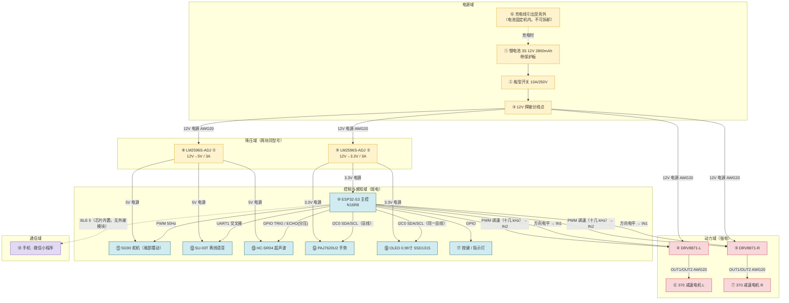
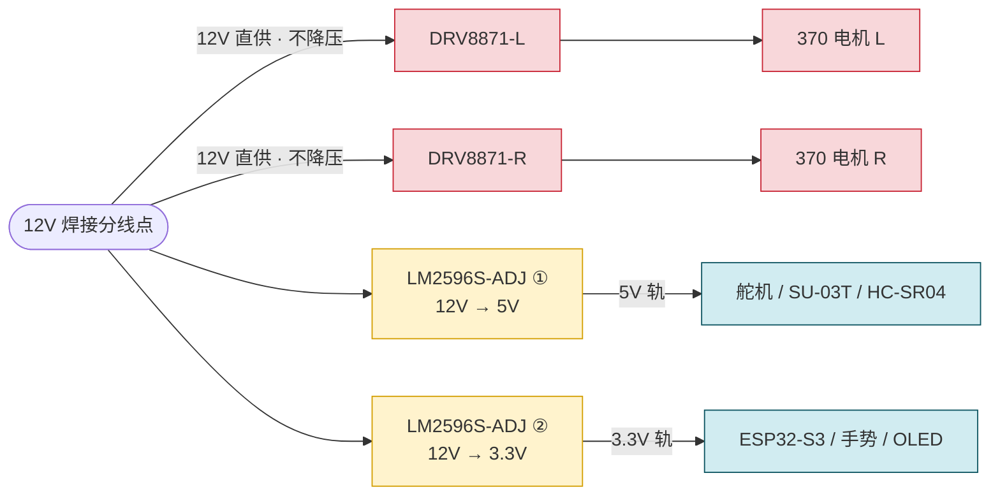
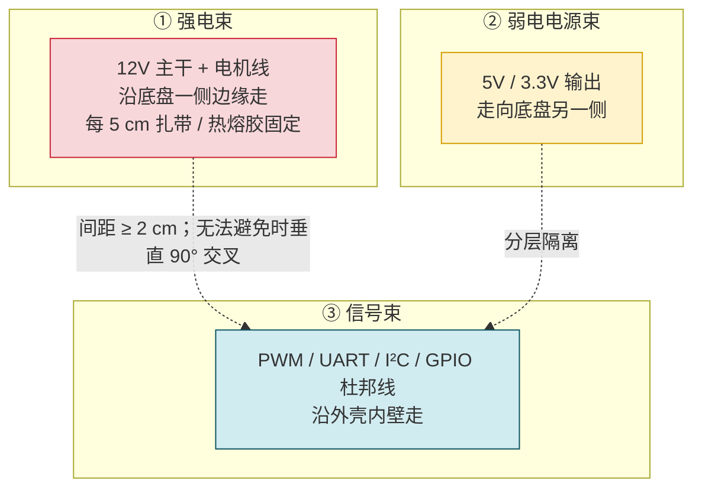

# 1 可动桌宠 · 选型文档

> [!important] AI 使用声明
> **本文档的选型结论、参数取值、器件链接与实物照片，均由本人查阅商品页、规格书、卖家与客服问询后得出；方案取舍与最终决定由本人作出。**
>
> 选型过程涉及的信息量较大、条目繁杂（多份规格书、多个商品页、大量需要交叉核对的参数），因此我借助了 AI 工具协助完成**信息整理与表达**，具体包括三个方面：
>
> 1. **结构化整理**：把散落在多份笔记、聊天记录与商品页截图中的数据，按题目 1.1.7(1) 规定的顺序重新归置、汇总成文；
> 2. **提示核查要点**：由 AI 提示"选型时应当核对哪些内容"（例如：驱动模块的电压上限与电机堵转电流的关系、舵机堵转电流的出处、I²C 总线地址与上拉电阻、PWM 定时器的频率冲突、线径的压降核算等），**再由本人逐项去查证与落实**；
> 3. **核算与检查**：协助完成电流、扭矩、减速比、压降、成本加总等计算，以及全文参数的一致性校验。
>
> **所有参数均标注了出处**（商品页 / 规格书 / 卖家确认）。凡查不到的项目，文档中均已注明是向客服询问还是如何估算，**未凭感觉填写**。器件是否买得到、接口与电压是否适配、客服能否提供调试资料——这些实物层面的判断由本人逐一向卖家确认。

> 项目：可动桌宠（256×256×200 mm，电池供电，能走、能听语音、能显表情、能识手势、能跟随人）
> 本文档按题目 1.1.7(1) 规定顺序组织：系统总览 → 物料清单 → 分系统选型说明 → 引脚分配表 → 接线表 → 成本核算与备选方案 → 选型过程记录。

---

# 2 一、系统总览

## 2.1 整机连接框图

框图节点编号与后文 **引脚分配表、接线表行号**相互对应，是全文索引。



**每段线跑什么**（框图图例，与 [[#6 接线表 ★|§6]] 接线表逐行对应）：

| 线型 | 电压/信号 | 走哪些段 | 线径 |
|---|---|---|---|
| **12V 主电源** | 12V DC，最坏 3.6 A | ①→②→③，③→④⑤，③→⑧⑨ | AWG20 硅胶线 |
| **电机输出** | 12V PWM，单路最坏 1.3 A | ④→⑥，⑤→⑦ | AWG20 硅胶线 |
| **5V 电源** | 5V，最坏 1.515 A | ⑧→⑪⑫⑬ | AWG20 焊杜邦头 |
| **3.3V 电源** | 3.3V，最坏 0.034 A | ⑨→⑩⑭⑮ | AWG20 焊杜邦头 |
| **PWM（50 Hz）** | 3.3V 逻辑 | ⑩→⑪ | 杜邦线 |
| **PWM（十几 kHz，调速）** | 3.3V 逻辑 | ⑩→④⑤ 的 `IN2` | 杜邦线 |
| **GPIO 电平（方向）** | 3.3V 逻辑 | ⑩→④⑤ 的 `IN1`、⑩→⑬、⑩→⑰ | 杜邦线 |
| **UART** | 3.3V 逻辑，交叉接 | ⑩↔⑫ | 杜邦线 |
| **I2C** | 3.3V 逻辑，400 kHz | ⑩↔⑭ 与 ⑩↔⑮（**同一条总线**） | 杜邦线，≤20 cm |
| **ADC** | 0~3.3V 模拟 | 母线电压分压点→⑩（调试用） | 杜邦线 |
| **BLE 无线** | 2.4 GHz | ⑩ ↔ ⑱ | — |

> **强弱电分离**：12V/电机线为强电束，5V/3.3V 为弱电电源束，PWM/UART/I2C 为信号束。三束分开走，信号束与强电束间距 ≥2 cm，无法避免时垂直 90° 交叉。
>
> **本方案不设保险丝**：电池自带保护板；外接保险丝经调研后放弃（理由见 [[#8.3.6 ⑥ 保险丝：查了资料之后决定不装|§8.3 ⑥]]）。

````horizontal

**整机分层布局**（与框图、接线表的分层走线对应）：

| 层 | 高度 | 放什么 |
|---|---|---|
| **底层** | 0~60 mm | 电池仓、2 个 370 电机、万向轮、两块 DRV8871 |
| **中层** | 60~120 mm | ESP32-S3 主控、两块 LM2596S-ADJ 降压、超声波、喇叭 |
| **顶层** | 120~200 mm | OLED、麦克风、手势模块（顶部或前部，无遮挡） |

---
![[电路相关信息-1790342675549.webp]]

**图：256×256×200 mm 整机选型评估配图**

````

## 2.2 整机是怎么工作的

整机由一块 **3S 12V 锂电池**供电（电池自带保护板），经船型开关后进入 **12V 焊接分线点**，由此分成三路：一路 12V 直供两块 **DRV8871 单路电机驱动**，各驱动一个 370 减速电机带动左右履带；另两路各经一块 **LM2596S-ADJ 可调降压模块**，分别稳到 **5V**（供舵机、语音、超声波）和 **3.3V**（供主控、手势、OLED）——**两轨用的是同一型号模块**，只是调到了不同输出电压。

主控 **ESP32-S3** 是整机的调度中心：它给舵机发 **50 Hz PWM** 控制摆尾；给两块 DRV8871 各发一路 **十几 kHz 的 PWM（接 `IN2`）做转速控制**、另一路 GPIO（接 `IN1`）做方向控制，从而实现履带的差速转向与调速；通过 **UART** 读 SU-03T 的离线语音识别结果；通过 **GPIO** 触发超声波测距（跟随人时保持距离），并保留一路 **ADC** 采母线电压用于调试；通过**一条 I2C 总线**同时挂手势模块（0x73）和 OLED（0x3C），读取手势、刷新表情。遥控指令走芯片**内置的 BLE 5** 与手机微信小程序直连——不依赖现场网络，也不需要外接蓝牙模块。

整机共占用主控 **15 个引脚**，剩余 30 个（按标称 45 GPIO 口径），为后续加 LED、加串口打印留足余量。

## 2.3 整机成本概览

按第 3 章物料清单逐项加总，**整机已知项合计 ≈ 295.5 元**。按"所属系统"分布如下：

| 所属系统 | 金额（元） | 占比 | 主要构成 |
|---|---|---|---|
| **传感** | 85.85 | 29.1% | 手势 42.55 / SU-03T 22.60 / OLED 10.88 / 超声波 + 支架 9.82 |
| **电源** | 44.28 | 15.0% | 锂电池（含充电器）34.70 / 两块 LM2596S-ADJ 7.08 / 船型开关 2.50 |
| **线材** | 40.50 | 13.7% | 热缩管 21.70 / 硅胶线 5.96 / 接线端子 5.80 / 杜邦线 4.40 / 公头转接线 2.64 |
| **驱动** | 34.24 | 11.6% | DRV8871 ×2（17.12 元/个） |
| **工具** | 31.00 | 10.5% | 数字万用表 23.80 / 剥线钳 7.20（USB 数据线随板附赠，0 元） |
| **主控** | 29.95 | 10.1% | ESP32-S3 N16R8 |
| **动力** | 29.65 | 10.0% | 370 电机 ×2（含支架）24.00 / SG90 舵机 5.65 |
| **通信** | **0** | 0% | 用 ESP32-S3 内置 BLE 5，不采购任何通信模块 |
| **合计** | **295.47** | 100% | — |

> **三点说明**：
> 1. **传感类占了近三成**，其中手势模块一件就 42.55 元——它是题目指定器件，不重新选型；若换 APDS-9960 可省约 30 元，但手势算法需自行处理。
> 2. **通信与下载器都是 0 元**：内置 BLE 省掉一颗外接蓝牙模块 + 一路串口；内置 USB Serial/JTAG 省掉 STLink（15~20 元）与 CH340（8~10 元）。
> 3. **工具类 31 元是一次性投入**，不随项目消耗；同理可调直流电源按实验室现有设备计，未计入本表。

---

# 3 物料清单（BOM）

## 3.1 BOM 表

> 字段严格按题目 1.1.7(2) 的 10 列。**链接直接给在表内**，点开即可加购。
> 标 `—` 的为**无需外购**的条目（#13 用内置 BLE、#19~#21 主控内置或随板附赠），不单独列链接。

| 序号 | 所属系统 | 器件名称 | 型号/规格 | 关键参数（3~5 个） | 数量 | 单价 | 链接 | 选型理由（一句话） | 备选方案 |
|---|---|---|---|---|---|---|---|---|---|
| 1 | 动力 | 370 直流减速电机 | GA25-370-1260，12V，减速比 103:1 | 12V／空载 5984 RPM(本体)／额定电流 0.3A／堵转 1.3A／额定扭矩 2.7 kg·cm | 2 | 24.00 元（含 2 电机 + 支架） | https://item.taobao.com/item.htm?id=638943394753 | 题目给定且不可改，103:1 是速度与扭矩窗口内唯一同时满足的现货档位 | 若整机超 2.5 kg ⇒ 换 171:1（扭矩够但速度破 0.1 m/s 下限）或升级 JGB 37-520 |
| 2 | 动力 | 舵机 | SG90 9g 模拟舵机 | 5V／扭矩 1.6 kg·cm(工作)／堵转 ≈1A／塑料齿／3P 杜邦 | 1 | 5.65 元 | https://detail.tmall.com/item.htm?id=530629424244 | 题目给定；9g 轻量适合尾部摆动，3P 标准接口可直接由主控 PWM 驱动 | 换成金属齿的 MG90S（若尾部摆动卡阻频繁导致扫齿，需换金属齿并接受重量上升） |
| 3 | 驱动 | 电机驱动模块 | **DRV8871** 单路直流电机驱动 | 6.5~45V／峰值 3.6A／默认限流 2A／OCP·TSD·UVLO／2.54mm 排针孔 | 2 | 17.12 元/个 ⇒ 34.24 元 | https://detail.tmall.com/item.htm?id=720709054866 | 唯一同时解决"满电 12.6V 超压"和"持续电流不够"的方案，且只占 4 个 GPIO | TB6612FNG（已淘汰：VM 上限仅 10V，超压 26%；持续 1.2A/路 < 堵转 1.3A）；DRV8833（双路但 VM 上限 10.8V，同样超压） |
| 4 | 电源 | 锂电池（**含配套充电器**） | 3S 12V 2800mAh 带保护板，DC 母头 | 标称 12V／2800mAh／持续放电 8A（≈2.86C）／瞬时 16A／带保护板／**配套 3S 平衡充电器** | 1 | **34.70 元（充电器与电池同链接、绑定计价）** | https://detail.tmall.com/item.htm?id=911754989740 | 电压与电机额定完全对齐（无需升降压），放电倍率 2.86C 对最坏 3.6A 有 2.2 倍余量；充电器与电池配套买，避免接口不匹配 | 4S 14.8V 电池（电压更高、同功率电流更小，但需为 5V/3.3V 降压留更大压差、且要确认驱动模块仍在其范围内）；多块不同电压电池分别供电（见 [[#4.1.4 为什么不用几块不同电压的电池分别供电？|§4.1.4]] 为什么不用） |
| 5 | 电源 | 降压模块 ①（5V 轨） | **LM2596S-ADJ** DC-DC 可调降压模块 | 输入 4.5~40V／输出 1.25~35V 可调／标称 3A／3mm 焊盘孔 | 1 | 3.54 元 | https://detail.tmall.com/item.htm?id=41307963557 | 5V 轨最坏 1.515A，3A 标称有 2 倍余量；模块便宜、满大街都是 | LM2596 带数显版（便于现场看电压，但体积大）；MP1584EN（体积更小，但**本方案已明确不采用**，见 [[#8.3.7 ⑦ 降压模块：从"两块不同型号"改成"两块同型号"|§8.3 ⑦]]） |
| 6 | 电源 | 降压模块 ②（3.3V 轨） | **LM2596S-ADJ**（**同型号**，调到 3.3V） | 输入 4.5~40V／输出 1.25~35V 可调／标称 3A／3mm 焊盘孔 | 1 | 3.54 元 | https://detail.tmall.com/item.htm?id=41307963557 | **两轨用同一型号**：BOM 少一个物料种类、备件通用、坏了一块可直接对换；3.3V 轨最坏仅 0.034A，余量极大 | AMS1117-3.3 LDO（最便宜最简单，但压差 8.7V × 0.034A ≈ 0.3W 发热，仅在小电流下可行）；MP1584EN（体积小，但**本方案已明确不采用**） |
| 7 | 电源 | 船型开关 | KCD1 船型开关 | 10A / 250V | 1 | 2.50 元 | https://item.taobao.com/item.htm?id=1006662779651 | 10A 额定远超最坏 3.6A；船型手感明确、可直接卡在 3D 打印外壳上 | 拨动开关（更小但手感差）；带灯的开关（多占一个指示灯位置） |
| 8 | 主控 | 主控开发板 | ESP32-S3 N16R8 开发板 | 双核 240MHz／16MB Flash + 8MB PSRAM／45 GPIO／3 UART·2 I2C·4 SPI／内置 BLE5 | 1 | 29.95 元 | https://detail.tmall.com/item.htm?id=896606984020 | 15 脚需求对 45 个 GPIO 余量 30；内置 BLE 省掉通信模块；内置 USB Serial/JTAG 省掉下载器 | ESP32-S3-DevKitC-1（官方版更稳但贵约 2 倍）；树莓派 Zero 2W（算力强但功耗高、无内置 JTAG、启动慢） |
| 9 | 传感 | 离线语音模块套件 | SU-03T + 麦克风 + 喇叭 | 3.6~5.5V／平均 60mA·峰值 >500mA／UART 最高 3Mbps／内置 2.4W 功放 | 1 | 22.60 元 | https://detail.tmall.com/item.htm?id=736159554057 | 题目给定；模块自带功放可直接接 4Ω 喇叭，不需外接功放板 | 天问 ASR 系列（识别词条更多但资料少）；LD3320（老方案，需外接功放） |
| 10 | 传感 | OLED 显示屏 | 0.96" SSD1315 **4 脚 I²C** 版，蓝色 | 128×64／**I²C（地址 0x3C）**／3.3~5V／引脚序 GND-VCC-SCL-SDA | 1 | 10.88 元 | https://detail.tmall.com/item.htm?id=617450807815 | 题目给定；**I²C 版只占 2 脚**，且能与手势模块共用同一条总线 | 若误买 SPI 版需占 4 脚（本方案已排除）；1.3 寸版（更大但需确认 I²C 地址是否仍为 0x3C） |
| 11 | 传感 | 超声波测距模块 | HC-SR04 | 5V 供电（不可 3.3V）／15mA／2~400cm／ECHO 输出 5V 需分压 | 1 | 5.39 元（支架 4.43 元） | https://item.taobao.com/item.htm?id=41248598447 | 题目给定；用于跟随人时保持距离，5V 供电需注意 ECHO 分压 | VL53L0X 激光 ToF（精度高、I²C 接口、不受声学干扰，但贵且量程短）；支架链接 https://e.tb.cn/h.7Tw7xU4E8hXhzVe?tk=U1cjfzDrPSr |
| 12 | 传感 | 手势识别模块 | CJMCU-7620（PAJ7620U2） | 3.3V／I²C（地址 0x73，400kbps）／内置识别算法不占算力／2 脚 | 1 | 42.55 元 | https://detail.tmall.com/item.htm?id=569499698342 | 题目给定；识别算法内置，主控只读结果，不占 CPU；与 OLED 同为 I²C 但地址不冲突 | APDS-9960（更便宜，但手势识别需自行处理、且自带接近/环境光功能冗余）；见 [[#4.3.3 三项冲突的正面回答|§4.3.3]] I²C 冲突四解法 |
| 13 | 通信 | 通信模块 | **无（用 ESP32-S3 内置 BLE 5）** | BLE 5／点对点直连／不占 UART·不占 GPIO／成本 0 | 0 | **0 元** | — | 小程序只支持 BLE、ESP32-S3 也只支持 BLE，两边正好对上；省掉一个模块和一路串口 | 外接串口蓝牙模块（HC-05/06 类）：多数是 Bluetooth Classic SPP，**微信小程序连不上**，且要占 1 个 UART；PS2 2.4G 手柄：延迟最好但控制端锁死、占引脚多、贵 40~80 元 |
| 14 | 线材 | 二进六出接线端子 | 快速接线端子，2 只装 | 2 进 6 出／用于 12V 分线点 | 1（组） | 5.80 元 / 2 只 | https://item.taobao.com/item.htm?id=1027246447489 | 12V 分线点要接 3 路负载，用端子比"拧一起焊死"更规整、可返工 | 直接焊死 + 大热缩管（更牢但不可返工）；PCB 接线端子排（体积大） |
| 15 | 线材 | 公头转接线 | DC/XH 公头转裸线，18cm | 18cm／线规 0.5mm² | 1 | 2.64 元 | https://item.taobao.com/item.htm?id=595422460986 | 电池是 DC 母头，系统侧是裸线，需要一根转接 | 直接买带裸线的电池（选择面窄）；自制转接线（要自己压接） |
| 16 | 线材 | 硅胶线 | AWG20 硅胶线，红/黑各 3m | AWG20（≈0.5mm²）／硅胶绝缘耐高温／载流约 5~8A | 1（套） | 5.96 元 | https://item.taobao.com/item.htm?id=915755499739 | 最坏 3.6A 下的压降仅 26mV（0.22%），且硅胶线柔软耐震、不易因履带震动磨破 | AWG22（更细更软，但压降翻倍、机械强度低）；AWG18（载流更足、压降更小，但过硬不好在 256mm 底盘内弯折） |
| 17 | 线材 | 杜邦线 | 10cm 母对母 ×40、15cm 母对母 ×40、15cm 公对母 ×10 | 2.54mm 间距 | 1（套） | 4.40 元 | https://item.taobao.com/item.htm?id=626699339752 | 分层布线：同层 10cm、跨层 15cm；**不买 30/40cm**（小车里易折叠被履带卷入） | 全部买 20cm（短距离会堆积成"蜘蛛网"）；买带锁扣的端子线（更牢但要配套插座） |
| 18 | 线材 | 热缩管 | 3~6mm 套装，300 根 | 3/4/5/6mm 多规格 | 1（盒） | 21.70 元 | https://detail.tmall.com/item.htm?id=655034561786 | **所有焊点必须包**，尤其是电机铜片——履带震动极易让裸露铜片短路 | 电工胶带（不收缩、不耐震动、易开胶）；不包（电机铜片外露，短路风险极高） |
| 19 | 工具 | **STLink** | — | — | **0（不需要）** | **0 元** | — | ESP32-S3 **内置 USB Serial/JTAG**，一根 Type-C 线即可下载 + 在线调试，无需外购 | 若换 STM32 主控则必须买（见 [[#4.3.7 STLink 与 CH340 —— 下载与调试（题目必答项）|§4.3.7]] 详细论证） |
| 20 | 工具 | **CH340** | — | — | **0（不需要）** | **0 元** | — | 同上，ESP32-S3 内置 USB 已含串口功能 | 同上 |
| 21 | 工具 | USB Type-C 数据线 | **随 ESP32-S3 开发板附赠** | 支持数据传输 | 1 | **0 元（附赠）** | —（随板附赠，无需另购） | 下载 + 串口打印共用一根；**确认是数据线**（纯充电线无法识别串口），若附赠的是纯充电线再另配 | Micro-USB 转接线（开发板是 Type-C 口，不适用） |
| 22 | 工具 | 剥线钳 | 德力西多功能剥线钳 | 适用 AWG20~AWG30 | 1 | **7.20 元** | https://detail.tmall.com/item.htm?id=714846811041&skuId=5196047297543 | 全车要剥大量 AWG20 硅胶线和杜邦线，专用剥线钳比剪刀/美工刀可靠得多 | 剪刀/美工刀（易伤线芯，硅胶线尤其容易剥断股）；自动剥线钳（更快但贵） |
| 23 | 工具 | 数字万用表 | 数字万用表（带通断蜂鸣档） | 直流电压/电阻/通断蜂鸣/电流档 | 1 | **23.80 元** | https://detail.tmall.com/item.htm?id=768119338888&skuId=5972063431312 | 1.2 调试两题的核心工具：量电池开路电压、测线束通断、测绕组电阻估堵转 | 指针式万用表（更便宜但读数慢、分辨率低）；带钳形电流的型号（能不断线测电流，但贵） |
| 24 | 工具 | 可调直流电源 | 可调压 / 可限流 / 带电流读数 | 0~30V 可调／限流可设／带电流显示 | 1 | —（按实验室现有设备计） | — | 1.2 调试基础两题的核心工具；**限流能力**是安全测堵转的前提，缺了就不敢直接给电机供电 | 只用万用表（无法替代供电、无限流，很多排查做不了）；实验电源箱（更好但体积大） |

> **"所属系统"分类说明**：按题目要求分八类——电源（#4~7）、动力（#1、2）、驱动（#3）、主控（#8）、传感（#9~12）、通信（#13）、线材（#14~18）、工具（#19~24）。
> **工具类没有漏**：STLink / CH340 已显式列出并说明为何不买；下载线、**剥线钳、万用表**已落实单价，可调电源待补。
> **充电器不单列**：3S 平衡充电器与电池**同链接绑定销售**，价格已含在 #4 的 34.70 元里。
> **保险丝已移除**：经调研后放弃，理由见 [[#8.3.6 ⑥ 保险丝：查了资料之后决定不装|§8.3 ⑥]]。

## 3.2 已有材料清单的落实

题目 1.1.6 给出四项已有材料。按 1.1.7(2) 要求，**它们不重新选型，但参数必须查全、写进表里，并注明接口方式与占主控几个脚**：

| 题目清单 | 对应 BOM | 参数是否查全 | 接口方式 | 占主控脚数 |
|---|---|---|---|---|
| 370 直流减速电机 ×2（`HU287`） | #1 | 见 [[#3.3.1 ① 370 直流减速电机 ×2（GA25-370-1260）|§3.3 ①]] | 两根铜薄片，**无外接端子，需自己焊线** | 共 **4**（每块 DRV8871 的 IN1/IN2） |
| SU-03T 语音套件（`HU293`） | #9 | 见 [[#3.3.7 ⑦ SU-03T 离线语音套件|§3.3 ⑦]] | **DIP18 排针/焊盘，模块不带排针，需自己焊** | **2**（UART 交叉接） |
| `HU591` | — | 已与出题人沟通确认，**不是问题** | — | — |
| 0.96 寸 OLED（`CA381`） | #10 | 见 [[#3.3.8 ⑧ OLED 0.96"（SSD1315，4 脚 I²C 版）|§3.3 ⑧]] | 2.54 mm 排针，**出厂已焊好**；4 脚 I²C | **2**（与手势共用 I²C 总线） |

> 四项里三项的参数已全部查全并落进 [[#3.3 关键器件参数卡|§3.3]] 的参数卡，且都在 [[#5 引脚分配表 ★|§5]] 引脚分配表里占到了具体引脚号；`HU591` 经与出题人沟通确认不是问题。

## 3.3 关键器件参数卡

> 题目 1.1.7(3) 要求每个关键器件单独成段，讲清**参数出处 / 为什么是这个参数 / 为什么不是别的**。以下逐器件给出。

### 3.3.1 ① 370 直流减速电机 ×2（GA25-370-1260）

![[../attachments/电路相关信息-1790256253942.webp]]

**图：370 电机商品页（参数页）截图**——减速比 ↔ 转速对照表即从此页读取。

**参数**（出处：**商品页** + **卖家确认**）

| 项 | 值 |
|---|---|
| 额定电压 | 12 V |
| 现货档位 | 45 / 78 / 103 / 171 |
| 装车档位 | **103:1** |
| 额定扭矩 | 45:1→1.0／78:1→2.0／**103:1→2.7**／171:1→4.0 kg·cm |
| 本体基准转速 | 空载 **5984 RPM** ／ 额定 **4400 RPM** |
| 额定电流 | **0.3 A** |
| 堵转电流 | **1.3 A** |
| 输出轴形式 | **D 形输出轴** |
| 减速箱齿轮材质 | **金属齿轮** |
| 传动效率 η | **0.7**（金属齿轮经验区间 0.6~0.8 取中值） |
| 接口方式 | 两根铜薄片，**无外接端子** |
| 占主控脚 | **2**（每个电机，经 DRV8871） |
**参数出处说明**：商品页只给了「减速比 ↔ 输出转速」对照表，**没有直接给本体转速**。取表中 **4.4:1** 那一行（空载 1360 RPM／额定 1000 RPM）反推：`5984 = 1360 × 4.4`、`4400 = 1000 × 4.4`；有了本体转速，其余档位即可换算 `n_out = n_本体 ÷ i`。
⇒ **45/78/103/171 各档的输出转速是这样算出来的，不是商品页直接给的。** 输出轴形式与齿轮材质由卖家确认。

### 3.3.2 ② SG90 舵机

![[选型文档-1790388874634.webp]]

**图：SG90 舵机商品页**——可见工作扭矩 1.6 kg/cm、转速 0.12~0.13 s/60°、使用电压 3-7.2V、转动角度 90°/180°、塑料齿、JR/FUTABA 通用 3P 接口。

**参数**（出处：**商品页** + **规格书 PDF**，两者不一致处已注明取哪个）

| 项 | 商品页 | 规格书 | 采用值 |
|---|---|---|---|
| 型号 | SG90 | GX90S（模板名） | **SG90** |
| 重量 | 9 g | 13.5±0.5 g | 9 g（规格书含摇臂螺丝） |
| 扭矩 | 工作扭矩 1.6 kg·cm | 堵转 1.8±0.3@4.8V／2.2±0.3@6.0V | **规格书堵转值** |
| 转速 | 0.12~0.13 s/60° | 0.11@4.8V／0.09@6.0V | 规格书 |
| 使用电压 | 3~7.2 V | 4.8~6.0 V | **取交集 4.8~6.0 V** |
| 堵转电流 | **未列** | `1±30mA`（单位疑排版错，语义应为 ≈1 A） | **≈1 A** |
| 空载电流 | 未列 | 120±10 mA @4.8V／180 mA @6.0V | 规格书 |
| 待机电流 | 未列 | 10 mA／20 mA | 规格书 |
| 结构材质 | **塑料齿** | — | **塑料齿** |
| 转动角度 | 90° / 180°（两个版本） | 操作角度 100° | — |
| 死区 | 5 μs | 4 μs | — |
| 控制方式 | — | 50 Hz PWM（0.5~2.5 ms 对应 0~180°），中位 1500 μs | 同左 |
| 使用温度 | −30~+60 ℃ | −10~+60 ℃ | **+60 ℃ 上限** |
| 接口方式 | JR/FUTABA 通用 **3P 杜邦母头**，线长 25 cm | 3P F 型母头，#26 AWG | 一致 |
| 占主控脚 | — | — | **1**（PWM 50 Hz） |
**参数出处说明（对应题目"查不到的必须写明"）**：**堵转电流商品页没有这一项**；我实查得到的值是 0.7 A，而规格书写的是 ≈1 A。**本表采用规格书的 ≈1 A**（两值取高者，天然满足"宁可高估"），0.7 A 作为实查记录保留在 [[#8 选型过程记录|§8]] 选型过程记录里。

### 3.3.3 ③ DRV8871 电机驱动模块 ×2

![[../attachments/DRV8871电机驱动模块-1790344238201.webp]]

**图：DRV8871 模块实物**——引脚定义、参数表、可调限流电阻。

**参数**（出处：**商品页**）

| 项 | 值 |
|---|---|
| 工作电压 | **6.5 ~ 45 V** |
| 控制电平 | 3.3 V / 5 V（主控可直驱，无需电平转换） |
| 峰值电流 | **3.6 A** |
| 默认限流 | **2 A**（板上可调电阻，出厂即 2 A） |
| 保护 | **OCP / TSD / UVLO**（过流 / 过热 / 欠压） |
| 驱动路数 | **单路 H 桥**（一块只能驱动一个直流电机） |
| 控制引脚 | `IN1` / `IN2` 两个 |
| 尺寸 | 24.7 × 20.9 mm |
| 接口 | 2.54 mm 排针孔；**附赠杜邦线端子，也可直接焊接** |
| 单价 | **17.12 元/个 × 2 = 34.24 元** |
| 占主控脚 | **每块 2 脚**（IN1 / IN2）⇒ 双电机共 **4 脚** |
| 链接 | https://detail.tmall.com/item.htm?id=720709054866 |
**参数出处说明**：全部来自商品页（含引脚图）。**控制方式、限流策略、布线策略见 [[#4.2 动力系统（对应 1.1.2）|§4.2]]**（那是"怎么用"，不属于参数卡）。

### 3.3.4 ④ 锂电池 3S 12V 2800mAh

![[../attachments/电路相关信息-1790323728760.webp]]

**图：3S 锂电池商品页（带保护板）**

![[../attachments/电路相关信息-1790385639001.webp]]

**图：电池保护板规格**

**参数**（出处：**商品页**）

| 项 | 值 |
|---|---|
| 标称电压 | 12 V（3S，满电 12.6 V） |
| 容量 | 2800 mAh |
| 持续放电 | **8 A** ⇒ 放电倍率 `C = 8 / 2.8 ≈ 2.86 C` |
| 瞬时放电 | 16 A |
| 保护 | **自带保护板** |
| 接口 | DC 母头 |
| 重量 | 约 170 g |
| 充电倍率 / 尺寸重量 | —（题目明确"尺寸和重量我们暂时不做要求"，故不作为选型依据） |
| 配套充电器 | 3S 平衡充电器，**与电池同链接绑定销售** |
| 单价 | **34.70 元（含充电器）** |
| 链接 | https://detail.tmall.com/item.htm?id=911754989740 |
**参数出处说明**：全部来自商品页。**为什么选这个电压/倍率/容量见 [[#4.1.1 电池选型与参数|§4.1.1]]**。

### 3.3.5 ⑤ 降压模块（LM2596S-ADJ × 2，两条电压轨用同一型号）

![[../attachments/电路相关信息-1790342626676.webp]]

**图：LM2596S-ADJ 可调降压模块**（12V → 5V / 3.3V）

**参数**（出处：**商品页**）

| 项 | 值 |
|---|---|
| 型号 | **LM2596S-ADJ**（可调输出版） |
| 输入范围 | 4.5 ~ 40 V |
| 输出范围 | 1.25 ~ 35 V 可调（板上多圈电位器） |
| 电流能力 | 标称 **3 A** |
| 接口形式 | **3 mm 焊盘孔**（无外接端子） |
| 数量 | **2 块**：① 调到 **5 V**，② 调到 **3.3 V** |
| 单价 | 3.54 元/块 ⇒ **7.08 元** |
| 链接 | https://detail.tmall.com/item.htm?id=41307963557 |
**参数出处说明**：全部来自商品页。**为什么两条轨用同一型号、为什么是分路而不是级联、各自承担多少电流见 [[#4.1.2 升降压系统：分路，不是级联|§4.1.2]] 与 [[#4.1.3 ★表① 全系统电压需求清单|§4.1.3]]**。

### 3.3.6 ⑥ ESP32-S3 主控开发板

![[../attachments/ESP32S3-1790385506534.webp]]

**图：ESP32-S3 开发板引脚功能图**

**参数**（出处：**商品页** + **芯片引脚图**）

| 项 | 值 |
|---|---|
| 型号 | **N16R8**（16 MB Flash + 8 MB PSRAM） |
| 核心 | 32-bit Xtensa **双核 @ 240 MHz** |
| 内存 | 512 KB SRAM（含 16 KB RTC SRAM）／ 384 KB ROM |
| 无线 | WiFi 802.11 b/g/n 2.4 GHz ＋ **BLE 5**（**不支持 Bluetooth Classic**） |
| 外设资源 | **45 GPIO**／4×SPI／**3×UART**／**2×I²C**／14×Touch／2×I²S／2×12-bit ADC／LED PWM／USB-OTG／DVP 摄像头接口 |
| 供电 | 3.3 V 逻辑，5 V 输入（板载 LDO） |
| 尺寸 / 安装孔 | 标准小板，四角 φ3 安装孔 |
| 单价 | **29.95 元** |
| 链接 | https://detail.tmall.com/item.htm?id=896606984020 |
**引脚的电气限制**（属参数范畴，分配 GPIO 前必须核对）：

| 脚 | 限制 |
|---|---|
| **GPIO 26~32** | 板载 Flash/PSRAM 专用，**禁止**做普通 IO |
| **GPIO 11~20（ADC2）** | **WiFi 开启时不可用** ⇒ 模拟输入一律走 **ADC1（GPIO 1~10）** |
| **GPIO 0 / 45 / 46** | **Strapping 脚**，上电电平决定启动模式，不挂强制上下拉 |
| **GPIO 19(D−) / 20(D+)** | **原生 USB**，不分给外设 |
| **GPIO 43 / 44** | 默认调试串口 U0（走板上 USB） |
**参数出处说明**：芯片参数与引脚限制来自商品页附带的引脚功能图与 ESP32-S3 规格。**为什么选它、引脚怎么分配见 [[#4.3 控制系统（对应 1.1.3）|§4.3]] 与 [[#5 引脚分配表 ★|§5]]**；PSRAM 在 Arduino 菜单里需勾选 OPI PSRAM 才可用。

### 3.3.7 ⑦ SU-03T 离线语音套件

![[../attachments/电路相关信息-1790340239113.webp]]

**图：SU-03T + 麦克风 + 喇叭套件实物**

![[../attachments/电路相关信息-1790340129463.webp]]

**图：SU-03T 接线图 ①**

![[../attachments/电路相关信息-1790340044190.webp]]

**图：SU-03T 接线图 ②**

**参数**（出处：**商品页** + **官方说明**）

| 项 | 值 |
|---|---|
| 供电 | 3.6~5.5 V（用 5 V）；**内置 5V→3.3V**，不需单独供 3.3V |
| 电流 | 平均 **60 mA**；峰值 **>500 mA**（4Ω 喇叭、音量最大） |
| 音频 | 内置 **2.4 W 单声道 AB 类功放**，直接接 4Ω 喇叭，**无需外接功放**；1 路驻极体麦 |
| 通信 | UART 全双工，最高 3 Mbps，**串口电平 3.3 V** |
| 算力 | 32bit RISC @240 MHz，2 MB FLASH，1024 点复数 FFT 加速 |
| 尺寸 / 封装 | 21×15×3(±0.2) mm，SMD18 / DIP18（2.54 mm） |
| 接口方式 | **DIP18 排针/焊盘，模块本身不带排针，需自己焊** |
| 占主控脚 | **2**（UART TX/RX 交叉接） |
| 单价 | 22.60 元 |
| 链接 | https://detail.tmall.com/item.htm?id=736159554057 |
**参数出处说明**：来自商品页与官方说明。**注意**：模块**不带排针**，正对应题目 1.3 的"三类焊线场景"第 ② 类，需自己焊排针（见 1.3 教学视频）。

### 3.3.8 ⑧ OLED 0.96"（SSD1315，4 脚 I²C 版）

![[../attachments/OLED模块-1790340399734.webp]]

**图：OLED 商品页截图**——可见 "4 管脚 / 通信方式 IIC / 引脚顺序 GND VCC SCL SDA"。这张图就是推翻"SPI 版"误判的直接证据（详见 [[#8.3.3 ③ OLED 认错了接口|§8.3 ③]]）。

**参数**（出处：**商品页** + **面板规格书 PDF** 双重确认）

| 项 | 值 | 出处 |
|---|---|---|
| 产品名 | 新款 0.96 寸 **4 管脚** 蓝色，焊好排针 | 商品页 |
| 分辨率 | 128×64，单色（白），Passive Matrix，1/64 Duty | 规格书 §1.1 |
| 驱动 IC | **SSD1315** | 商品页 + 规格书 |
| **通信方式** | **I²C**（模块板上 BS0/BS1 已焊死选 I²C） | 商品页 |
| **引脚顺序** | **GND → VCC → SCL → SDA**（共 4 脚） | 商品页 |
| **I²C 从机地址** | **0x3C**（默认，D/C# 接 GND）；D/C# 接 VDD 时为 0x3D | 规格书 §4.4.2 |
| 工作电压 | 3.3 ~ 5 V（模块自带升压；裸屏本征 VDD 1.65~3.3 V + VCC 9 V） | 商品页 / 规格书 |
| 电流 | 逻辑 IDD 160~220 μA ＋ 内部 DC/DC **IBAT 25.0~32.0 mA** | 规格书 §3.2 |
| 尺寸 | 模块 27×26.5 mm；裸屏 24.74×16.9×1.42 mm；显示区 22.5×11.5 mm | 商品页 + 规格书 |
| 视角 / 温度 | 全视角 / −20~+60 ℃（裸屏 −30~70 ℃） | 商品页 |
| 像素 | pitch 0.17×0.17 mm，pixel 0.15×0.15 mm | 规格书 §1.2 |
| 接口方式 | 2.54 mm 排针，**出厂已焊好**；四角 φ2 mm 安装孔（孔距 22.3×21 mm） | 商品页 |
| 占主控脚 | **2**（与手势模块共用同一条 I²C 总线） | 推算 |
**参数出处说明**：这里我一开始**判断错了**——看到规格书里有 `D/C#`、`CS#`、`RES#` 就认定买的是 SPI 版，按 4 个引脚算预算。后来回查商品页截图才发现写得很清楚：4 管脚、通信方式 IIC、引脚顺序 GND VCC SCL SDA。**那是面板（裸屏，30 脚）的规格书，不是模块的**；模块板上已把 BS0/BS1 焊死选定了 I²C。这条更正让引脚预算省下 2 个（详见 [[#8.3.3 ③ OLED 认错了接口|§8.3 ③]]）。

### 3.3.9 ⑨ HC-SR04 超声波

![[../attachments/电路相关信息-1790341186894.webp]]

**图：HC-SR04 商品页**（4 Pin 引脚定义）

**参数**（出处：**商品页**）

| 项 | 值 |
|---|---|
| 供电 | **5 V（必须，不能 3.3V）** |
| 电流 | 15 mA |
| 量程 | 2 ~ 400 cm |
| 尺寸 | 45 × 20 × 15 mm |
| 工作原理 | TRIG 输入 ≥10 μs 高电平触发，ECHO 输出高电平持续时间与距离成正比 |
| 电平特性 | VCC 是 5V ⇒ **ECHO 输出高电平也是 5V**（主控为 3.3V 逻辑，需分压） |
| 接口方式 | 4 Pin（VCC / GND / TRIG / ECHO），2.54 mm |
| 占主控脚 | **2**（TRIG 输出、ECHO 输入） |
| 单价 | 5.39 元（支架 4.43 元） |
| 链接 | https://item.taobao.com/item.htm?id=41248598447 |
**参数出处说明**：来自商品页。**ECHO 的分压处理见 [[#4.4.1 三组接口分别说明|§4.4.1]]**。

### 3.3.10 ⑩ PAJ7620U2 手势传感器（CJMCU-7620）

![[../attachments/PAJ7620U2手势传感器模块-1790341301770.webp]]

**图：CJMCU-7620（PAJ7620U2）手势模块实物与引脚**

**参数**（出处：**商品页** + **模块说明**）

| 项 | 值 |
|---|---|
| 供电 | **3.3 V**（接 5V 需确认模块是否带电平转换） |
| 通信 | **I²C，速率最高 400 kbit/s** |
| **从机地址** | **0x73** |
| 算法 | **识别算法内置**，主控只读结果，**不占主控算力** |
| 接口方式 | 排针，SDA / SCL / VCC / GND（+ INT） |
| 占主控脚 | **2**（与 OLED 共用 I²C0） |
| 单价 | 42.55 元 |
| 链接 | https://detail.tmall.com/item.htm?id=569499698342 |
**参数出处说明**：来自商品页与模块说明。**I²C 地址冲突与上拉核算见 [[#5.1 三项冲突说明（题目要求单独说明）|§5.1]] 与 [[#4.4.5 I²C 上拉核算|§4.4.5]]**。

### 3.3.11 ⑪ 通信模块（= ESP32-S3 内置 BLE 5，**无需采购**）

**参数**（出处：**ESP32-S3 芯片规格**）

| 项 | 值 |
|---|---|
| 方案 | **手机蓝牙 + 微信小程序**，走 ESP32-S3 **内置 BLE 5** |
| 协议 | **BLE**（GATT 服务 / 特征值），**不是** Bluetooth Classic |
| 通信距离 | 空旷十米级，室内更短、穿墙差（本题只需 3~5 m） |
| 占主控资源 | **0 个 UART、0 个 GPIO**（芯片内置） |
| 需要额外采购 | **无**——模块、天线、配套线材、电池，全都不用买 |
| 单价 / 数量 | **0 元 / 0 件** |
| 链接 | —（无采购项） |
**参数出处说明**：不是从某个商品页抄的，而是**由 ESP32-S3 的芯片规格推导**——主控板本身已内置 BLE 5 射频与天线，因此这一格是"没有器件"。**为什么选这个方案、另外三条路各自差在哪，见 [[#4.5 通信系统（对应 1.1.5）|§4.5]]**。

---

# 4 分系统选型说明

## 4.1 电源系统（对应 1.1.1）

### 4.1.1 电池选型与参数

见 [[#3.3.4 ④ 锂电池 3S 12V 2800mAh|§3.3 ④]]。核心结论：**3S 12V 2800mAh 带保护板锂电池**，理由三条——① 电压与电机额定完全对齐；② 放电倍率 2.86C 对最坏 3.6 A 有 2.2 倍余量；③ 容量对应约 2.5 h 实际续航。

### 4.1.2 升降压系统：分路，不是级联

**12V 分线点共分出三条支路**——一条 **12V 直供电机驱动**（不经降压），另两条分别降压形成两个电压轨：



**电机支路为什么直供 12V、不降压**：370 的额定电压就是 12V，与电池**完全对齐**（差距为零），再降压反而多一层损耗；DRV8871 的工作范围 **6.5~45 V** 已完整覆盖 12V 标称与 12.6V 满电。直供的另一个好处是 **PWM 可满量程使用**，避开"电池电压远高于电机额定、只能一直以很小占空比工作"带来的低速力矩差、发热与啸叫。

**为什么两个电压轨是分路而不是 12V→5V→3.3V 级联**：
1. 每一级都吃一次效率损失，级联要付两次；
2. **分路后舵机堵转不会拖累 3.3V 轨** —— 这正是 1.2.2 题「舵机一动蓝牙断连」的**预防性设计**；
3. 两条轨互不干扰，排查时可以单独断开一路来定位问题。

**为什么两条轨用同型号模块（LM2596S-ADJ）**：BOM 少一个物料种类、备件通用、坏了一块能直接对换定位；"ADJ 可调"版是这一做法能成立的前提——同一块板调电位器就能出 5V 或 3.3V。详见 [[#3.3.5 ⑤ 降压模块（LM2596S-ADJ × 2，两条电压轨用同一型号）|§3.3 ⑤]]。

**电池保护系统**：由**电池自带的保护板**承担（过充/过放/过流保护）。

**本方案不外加保险丝**：原计划在 12V 入口串一颗 5A 自恢复保险丝，但调研后发现**保险丝的接口形式（多为贴片或引针封装）与我这里的接线方式对不上，接入现有电路很不方便**，最终放弃。理由详见 [[#8.3.6 ⑥ 保险丝：查了资料之后决定不装|§8.3 ⑥]]。

**充电口**：**不做可拆卸电池，也不额外买充电口模块**——电池**固定在机内**，**从机身引出一根充电线到外壳**，充电时直接把配套的 3S 平衡充电器插上即可。配套充电器与电池**同链接绑定销售**（价格已含在电池的 34.70 元里），不需要单独选型。

> **为什么不做可拆卸**：可拆卸意味着要买电池座/插拔端子、要在结构上留出电池仓和取出空间，而 256×256×200 mm 内部本来就紧（见 [[#4.2.2 减速比论证（速度窗口 ∩ 扭矩窗口）|§4.2.2]] 的 1.5 kg 红线）。**引一根线出来**是最省事、最省空间、也最不容易接触不良的做法。

### 4.1.3 ★表① 全系统电压需求清单

| 器件 | 需要电压 | 工作电流 | 供电来源 |
|---|---|---|---|
| 370 电机 L | 12 V | 额定 0.3 A ／ 堵转 1.3 A | 电池直供（经 DRV8871-L `Power+`） |
| 370 电机 R | 12 V | 额定 0.3 A ／ 堵转 1.3 A | 电池直供（经 DRV8871-R `Power+`） |
| 舵机 SG90 | 5 V | 空载 180 mA@6V ／ **堵转 ≈1 A** | LM2596S 5V 轨 |
| SU-03T 语音 | 5 V | 平均 60 mA ／ **峰值 >500 mA** | LM2596S 5V 轨 |
| HC-SR04 超声波 | **5 V（必须）** | 15 mA | LM2596S 5V 轨 |
| ESP32-S3 主控 | **5 V**（板载 LDO 转 3.3 V） | 100~240 mA（无线活动） | LM2596S-ADJ ① 5V 轨 |
| 手势 PAJ7620U2 | 3.3 V | 1~2 mA | LM2596S-ADJ ② 3.3V 轨 |
| OLED SSD1315 | 3.3~5 V | **25.0~32.0 mA**（规格书 IBAT） | LM2596S-ADJ ② 3.3V 轨 |
| 通信（内置 BLE） | — | **无独立模块**，功耗增量含在主控内 | — |
**逐项核对（拿电池参数与降压模块参数对照）**：

| 轨 | 合计电流 | 模块能力 | 余量 | 结论 |
|---|---|---|---|---|
| **5 V** | 舵机 1.0 + 语音 0.5 + 超声波 0.015 + **主控 0.24** = **1.755 A** | LM2596S-ADJ ① **3 A** | **1.71×** | 够用，但**必须加散热片** |
| **3.3 V** | 手势 0.002 + OLED 0.032 = **0.034 A** | LM2596S-ADJ ② **3 A** | **≈88×** | 极宽裕，无需散热 |
| **12 V 电池放电** | 最坏 3.6 A（双电机堵转 2.6 + 舵机堵转 1.0） | 持续 **8 A** | **2.2×** | 充裕 |

> **ESP32-S3 走 5V 轨**：开发板板载 LDO 转 3.3V，5V 输入是官方推荐用法。⇒ **5V 轨最坏值按 1.755 A 核算**，上表余量 1.71× 已计入主控。

### 4.1.4 为什么不用几块不同电压的电池分别供电？

四个必须解决的问题：

1. **共地**：多个独立电源的地必须连在一起，否则信号电平没有共同参考，UART/I²C 直接通信失败。地一连，又绕回了"共电源路径"，舵机堵转照样会把地弹起来——**问题没被解决，只是被搬走了**。
2. **各自充电管理**：每块电池都要各自的保护板、各自的充电器、各自的充电口，充电时还要分别插，用户体验极差。
3. **重量与体积**：256×256×200 mm 内要塞 2~3 块电池，重量直接顶穿 [[#4.2.2 减速比论证（速度窗口 ∩ 扭矩窗口）|§4.2.2]] 的 1.5 kg 红线（而整机重量又直接决定减速比裕度）。
4. **电量不均衡**：各轨耗电差异极大（5V 轨 1.5 A vs 3.3V 轨 0.034 A），会一块先没电一块还剩大半，充放电都很别扭。

**结论**：单块 12V 电池 + 分路降压，用两级降压换取"共地、单点充电、重量可控、电量统一"。

## 4.2 动力系统（对应 1.1.2）

### 4.2.1 参数查全

见 [[#3.3.1 ① 370 直流减速电机 ×2（GA25-370-1260）|§3.3 ①]]、[[#3.3.2 ② SG90 舵机|§3.3 ②]]。**已查全**：

| 器件 | 已查全的参数 |
|---|---|
| 370 电机 | 额定电压、空载转速（本体基准，由 4.4:1 档反推）、额定电流、堵转电流、减速比、**额定扭矩、堵转扭矩**（经档位表）、**输出轴形式**、**减速箱齿轮材质** |
| 舵机 SG90 | 工作电压、扭矩（工作 / 堵转）、转速、堵转电流、空载与待机电流、控制方式、接口形式 |

> **"D 形输出轴"对结构的影响**：D 形轴（轴端削平一个平面）靠**平面传扭**，比光轴靠顶丝摩擦传扭可靠得多——履带差速转向时扭矩脉动大，光轴很容易顶丝打滑"扫圆"。
> ⇒ **驱动轮的轮毂必须是 D 字孔**。这是"驱动轮从哪来"的前置条件：**买套件**要先查套件轮子的孔径与孔型是否匹配；**自己 3D 打印**则按 D 形轴尺寸开孔。

### 4.2.2 减速比论证（速度窗口 ∩ 扭矩窗口）

**各参数的来源**（题目要求"不要凭感觉填"，所以逐个标出处）：

| 参数 | 取值 | 来源 |
| ---------- | ----------------- | ------------------------------------ |
| 轮径 `r` | 0.02 m（40 mm） | 计划采用的轮子规格 |
| 轮距 `L` | 0.15 m | 结构布局 |
| 传动效率 `η` | 0.7 | **370 为金属齿轮**（经验区间 0.6~0.8），取中值 0.7 |
| 桌面摩擦系数 `μ` | **0.3** | **由客服提供的运行场景（硬质桌面）+ 查资料推得**，见 [[#8.4.1 已问、且已经用进设计的|§8.4.1]] |
| 整机质量 `m` | **2.5 kg** | **参照客服给出的同类小车重量量级预估**，见 [[#8.4.1 已问、且已经用进设计的|§8.4.1]] |
| 目标加速度 `a` | 0.5 m/s² | 设计取值 |
| 目标直行速度 `v` | **0.1 ~ 0.3 m/s** | **由客服给出的实车移动速度 + 演示视频观感确定**，见 [[#8.4.1 已问、且已经用进设计的|§8.4.1]] |

$$
\begin{aligned}
\text{直行}\quad n_{drive} &\in \left[\frac{60 \times 0.1}{2\pi \times 0.02},\ \frac{60 \times 0.3}{2\pi \times 0.02}\right] = [47.7,\ 143.2]\ \text{RPM} \\
\text{转向}\quad n_{turn} &\in \left[\frac{60 \times 0.15 \times 0.524}{2\pi \times 0.02},\ \frac{60 \times 0.15 \times 1.571}{2\pi \times 0.02}\right] = [37.5,\ 112.5]\ \text{RPM} \\
\text{合取}\quad n_{out} &\in [37.5,\ 143.2]\ \text{RPM} \\
\text{减速比}\quad i &\in \left[\frac{5984}{143.2},\ \frac{4400}{37.5}\right] = [41.8,\ 117.3]
\end{aligned}
$$

⇒ 对照现货档位 **45 / 78 / 103**（171 超出上限）。

**扭矩论证（按最坏整机 2.5 kg）**：

$$
T_{单机} = \frac{m(\mu g + a) r}{N \eta} = \frac{2.5 \times (0.3 \times 9.8 + 0.5) \times 0.02}{2 \times 0.7} \approx 0.123\ \text{N·m} \approx 1.25\ \text{kg·cm}
$$

安全系数 ×2 ⇒ **需求 2.5 kg·cm**。

| 档位 | 额定扭矩 | 裕度 | 判定 |
|---|---|---|---|
| 45:1 | 1.0 kg·cm | 0.40 | 严重不足 |
| 78:1 | 2.0 kg·cm | 0.80 | 不足 |
| **103:1** | **2.7 kg·cm** | **1.08** | **勉强达标（采用）** |
| 171:1 | 4.0 kg·cm | 1.60 | 扭矩够，但输出 27 RPM ⇒ 0.056 m/s 破速度下限 |
**⇒ 结论：选 103:1。**

**根本矛盾**：103:1 是"在速度和扭矩的边缘试探"，裕度仅 **1.08，意味着没有任何冗余**。若整机逼近 2.5 kg，GA25-370 在 12V 下就是物理瓶颈。
⇒ **可执行的工程约束：把整机压到 1.5 kg 以内**——**绝不用金属底盘**，3D 打印件、底板厚 3~4 mm。

### 4.2.3 看电压

- **电池电压 vs 电机额定**：12 V vs 12 V ⇒ **差距为零，完美匹配**，无需升降压。
- **驱动模块 VM 范围是否覆盖**：DRV8871 工作范围 **6.5~45 V**，12 V 标称与 **12.6 V 满电**都在范围内 。（这正是淘汰 TB6612 的首要原因——它只有 4.5~10 V。）
- **如果电池电压远高于电机额定怎么办**：两条路——① 让驱动一直以很小占空比工作；② 先降压再给电机。**本方案两者都不需要**（电压已对齐）。作为对照：小占空比工作的代价是**低速力矩差**（占空比小 ⇒ 等效电压低 ⇒ 转矩低）、**发热**（开关损耗占比上升）、**噪声**（人耳可闻的 PWM 啸叫）。这也是选 12V 而非更高电压电池的论据之一。
- **驱动逻辑侧供电**：DRV8871 控制电平 3.3V/5V 兼容 ⇒ **无需单独逻辑供电，ESP32-S3 的 3.3V GPIO 直接驱动**。

### 4.2.4 ★表② 电流核算表

| 工况 | 电流 | 出处 |
|---|---|---|
| 电机 L 额定 | `0.3 A` | 商品页 |
| 电机 R 额定 | `0.3 A` | 商品页 |
| 舵机 工作 | `0.15 A`（@5V） | 规格书（@6V 空载 180 mA 折算） |
| **── 正常工作合计 ──** | **`0.75 A`** | |
| 电机 L 堵转 | `1.3 A` | 商品页 |
| 电机 R 堵转 | `1.3 A` | 商品页 |
| 舵机 堵转 | **`1.0 A`** | 规格书 |
| **── 最坏情况合计 ──** | **`3.6 A`** | |
| **启动瞬间 / 压过数据线 / 被人按住** | ≈ `1.3 A × 2 = 2.6 A` | 启动瞬间转子未转、反电动势为 0 ⇒ 电流≈堵转 |
| **两个电机同时堵转** | **`2.6 A`** | **不是额定，是堵转** |
| 舵机尾部被卡住不动 | **`1.0 A`** | 规格书堵转值 |
| 原地转向搓地（待实测） | 预计高于正常行进 | 见下 |

> **一个待实测的补充工况：原地转向搓地**。硬质桌面上履带原地转向时，横向搓动摩擦比直线滚动大数倍，每轮扭矩约为直行的 **2 倍量级** ⇒ 电流也可能高于"正常行进"。本方案把它列为"待实测"，因为最坏工况不只有堵转一种。

**对照驱动模块（持续 / 峰值）**：

| 项 | 计算 | 结果 |
|---|---|---|
| 单块 DRV8871 **限流** ÷ 单电机堵转 | 2.0 ÷ 1.3 | **1.54×** |
| 单块 DRV8871 **峰值** ÷ 单电机堵转 | 3.6 ÷ 1.3 | **2.77×** |
| 双电机同时堵转总电流 ÷ 单块限流 | 2.6 ÷ 2.0 | **1.30× ⇒ 触发限流保护**（**设计意图**：把电流摁住，护住电机与塑料齿轮箱） |
**散热**：堵转 1.3 A 未逼近 2 A 限流，且模块自带 **TSD 过热保护** ⇒ **不需额外加散热片或导热垫**。（对比：原 TB6612 方案双堵转时逼近持续上限，芯片背面必须加导热硅胶垫。）

### 4.2.5 看控制方式

#### 4.2.5.1 （1）IN1 / IN2 功能真值表

| IN1 状态 | IN2 状态 | 电机状态（OUT1, OUT2） | 说明 |
|---|---|---|---|
| 0 | 0 | **滑行停止（怠速）** | 电机两端断开，自由滑行。长时间保持 00 会自动进入低功耗睡眠模式 |
| 1 | 0 | **正转** | OUT1 输出高电平，OUT2 输出低电平 |
| 0 | 1 | **反转** | OUT1 输出低电平，OUT2 输出高电平 |
| 1 | 1 | **刹车（制动）** | OUT1 和 OUT2 同时接地，电机迅速停止 |

（注：0 代表低电平，1 代表高电平）

#### 4.2.5.2 （2）如何用这两个引脚实现 PWM 调速

这是 DRV8871 最巧妙的地方：**调速时不能直接把 IN1 和 IN2 都接到固定高电平**，而是要把**其中一个引脚设为低电平，另一个引脚输出 PWM 波**。

- **正转调速**：`IN1` 设为 **0（低电平）**，`IN2` 输入 **PWM 信号**。**IN2 的高电平占空比越大，电机转速越快**。
- **反转调速**：`IN1` 输入 **PWM 信号**，`IN2` 设为 **0（低电平）**。**IN1 的高电平占空比越大，电机转速越快**。
- **停车**：`IN1` 和 `IN2` 都设为 **1**（刹车）或都设为 **0**（滑行）。

⇒ **本方案由此定下引脚用法：每个电机占 2 个主控引脚——一路固定做「方向电平」（GPIO），一路专门出「转速 PWM」。** 这正是 [[#2.1 整机连接框图|§2.1]] 框图里「PWM（十几 kHz，调速）」与「GPIO 电平（方向）」两条线型的由来。

#### 4.2.5.3 （3）接线与代码实操（以 ESP32-S3 为例）

| 驱动模块 | ESP32-S3 引脚 | 功能 |
|---|---|---|
| 左电机 DRV8871 | **GPIO 4 → IN1** | 左电机方向 / 调速 |
| | **GPIO 5 → IN2** | 左电机方向 / 调速 |
| 右电机 DRV8871 | **GPIO 6 → IN1** | 右电机方向 / 调速 |
| | **GPIO 7 → IN2** | 右电机方向 / 调速 |

```cpp
// 正转：IN1 低电平，IN2 输出 PWM
digitalWrite(IN1_PIN, LOW);
ledcWrite(IN2_PIN, 128); // 128/255 ≈ 50% 速度

// 反转：IN1 输出 PWM，IN2 低电平
ledcWrite(IN1_PIN, 128);
digitalWrite(IN2_PIN, LOW);

// 刹车
digitalWrite(IN1_PIN, HIGH);
digitalWrite(IN2_PIN, HIGH);
```

#### 4.2.5.4 （4）为什么只有一个电机接口

因为 **DRV8871 是单路 H 桥驱动器**，一个模块只能驱动一个直流电机（或步进电机的一个绕组）。桌宠是双轮驱动，所以**需要买 2 块 DRV8871 模块**——每块占用主控 **2 个 GPIO**，**总共 4 个 GPIO**，比 TB6612 的 7 个引脚**省了 3 个**。

#### 4.2.5.5 （5）其余控制相关问答

- **模块逻辑**：DRV8871 是 **IN1/IN2 两脚** 控制——`IN1 置低 + IN2 出 PWM` = 正转调速，反过来 = 反转调速，`1/1` = 刹车，`0/0` = 滑行。
- **两个电机加一个舵机，总共占主控几个 GPIO**：电机 **4 个**（每块 2 个）+ 舵机 **1 个** = **5 个**。
- **其中几路必须是硬件 PWM**：电机两路（十几 kHz）、舵机一路（50 Hz），共 **3 路**。二者频率差三个数量级，**必须分到不同定时器**（见 [[#5.1 三项冲突说明（题目要求单独说明）|§5.1]] 三项冲突说明）。
- **逻辑侧电平能否被 3.3V 单片机直驱**： 能（模块标称控制电平 3.3V/5V），**无需电平转换，也无需另买转接板**。
- **有没有使能脚或休眠脚、要不要接主控**：DRV8871 **没有独立的 EN/STBY 脚**——它靠 `IN1=IN2=0` 进入睡眠（低功耗）。这是相对 TB6612 的一处简化：**省掉了 STBY 这一个 GPIO，也省掉了"忘记拉高使能导致电机不转"这类调试坑**。

### 4.2.6 看保护与功能

| 问 | 答 |
|---|---|
| 过流 / 过热 / 欠压保护 | **OCP / TSD / UVLO 三重齐备** |
| 电流检测输出 | 无 IPROPI 引出（DRV8871 芯片有此功能，但本成品模块未引出） |
| 做速度闭环 / 走直线是否用得上 | **用得上，但本方案不做**：闭环需要编码器或电流反馈。370 可选购**带霍尔编码器的 6 线版本**，若后续要做闭环 PID 或走直线，这是升级路径 |
| 模块没保护要不要自己串保险丝 | **本方案不加外部保险丝**：DRV8871 自带 OCP/TSD/UVLO 保护；电池自带保护板；外加保险丝经调研后因**接口形式不匹配**放弃（见 [[#8.3.6 ⑥ 保险丝：查了资料之后决定不装|§8.3 ⑥]]） |
**限流策略**：保持出厂默认 **2 A 不动**——370 堵转 1.3 A 落在其内，且该限流能挡住瞬间大电流冲击**塑料齿轮箱**。双电机同时堵转总电流 2.6 A > 2 A ⇒ 会触发限流，这是**设计意图**而非缺陷。

### 4.2.7 看模块形态

| 问 | 答 |
| ---------------- | -------------------------------------------------------------------------------------------- |
| 接口是排针、端子还是焊盘 | **2.54 mm 排针孔**，可焊排针插杜邦线，也可直接焊线；**附赠杜邦线端子** |
| 能否和线材对得上 | 大电流侧直接用 AWG20 焊在孔上；小信号侧用附赠端子接杜邦线 |
| 板上带不带稳压和电平转换 | 无稳压（`Power+` 即电机电源），控制电平 3.3V/5V 兼容，**无需电平转换** |
| 有没有引出全部控制脚 | `IN1`/`IN2`/`GND`/`Power±`/`OUT1`/`OUT2` 全部引出 |
| 尺寸 / 螺丝孔 / 能否固定 | 24.7 × 20.9 mm，**比原 TB6612（20.5×20.4）略大**，256 mm 底盘足以容纳；安装用 3M 双面胶或热熔胶固定在底板即可（模块为小尺寸成品板，重量轻） |
| 有没有现成例程或资料 | 基础驱动逻辑极简（见真值表），任意 GPIO/PWM 教程可直接套用 |
| **为什么选这块而不是另一块** | 见 [[#8.3.4 ④ 电机驱动模块从 TB6612 换成了 DRV8871]] |
**布线策略**：大电流（`Power±`、`OUT1/OUT2`）**直接焊 AWG20 + 热缩管全包**；仅 `IN1`/`IN2`/`GND` 这几个 mA 级信号用模块附赠的杜邦端子。

### 4.2.8 舵机怎么接 —— 直连主控

| 路线 | 接法 | 判定 |
|---|---|---|
| **(a) 舵机直连主控** **采用** | `主控 --PWM 50Hz--> 舵机`，舵机电源从 5V 轨单独取 | 常规做法；驱动只管 2 个电机 |
| (b) "一块板同带电机 + 舵机" | 需多路驱动板或额外舵机驱动板 | **已排除** |
**判据**：① 题目 1.1.2 追问"两个电机加一个舵机，总共占主控几个 GPIO"，措辞是**统一算引脚**，说明舵机也占主控脚；② **舵机内部自带驱动电路**，只需「电源 + 50 Hz PWM 信号」，接到 H 桥输出上**会烧**；③ 换用 DRV8871（**单路、无舵机接口**）后，物理上不可能用一块板同时带两个电机 + 舵机。⇒ **结论锁定 (a)**。

### 4.2.9 舵机的两条工程约束（来自商品页）

| 约束 | 内容 | 落到哪 |
|---|---|---|
| **塑料齿** | 商品页明说"不能承受大扭矩过载"。尾摆卡到异物 ⇒ **极易扫齿甚至烧电机** | **结构上要防卡死**（尾部摆动范围内不得有干涉物） |
| **软启动** | 代码里 **PWM 必须缓慢变化**，避免瞬间满占空比给齿轮冲击扭矩 | 固件里限制占空比变化率 |

> **两条约束的内在联系**：1.2.2 题「舵机一动蓝牙断连」的缓解措施之一，正是 **PWM 缓启动（限制占空比变化率）**。
> ⇒ 为保护塑料齿做的软启动，同时也是该问题的预防措施——**选型阶段就已经考虑了调试阶段的问题**。

## 4.3 控制系统（对应 1.1.3）

### 4.3.1 引脚需求表（先把需求摊开）

| 外设 | 接口类型 | 占用线数 |
|---|---|---|
| DRV8871-L / -R（电机驱动） | PWM + GPIO | 4 |
| 舵机 SG90 | PWM（50 Hz） | 1 |
| HC-SR04 超声波 | GPIO | 2 |
| 手势 PAJ7620U2 ＋ OLED SSD1315 | **I2C（同一总线）** | **2** |
| SU-03T 语音 | UART | 2 |
| 调试串口 | UART | 2 |
| 按键 / 指示灯 | GPIO | 1 |
| **── 小计 ──** | | **14** |
| 备用 — 母线电压采集（1.2 调试用） | ADC1 | 1 |
| **合计** | | **15** |

> **I²C 这 2 个脚只能算一次**：手势和 OLED 共用同一条总线（GPIO 8/9），不是"两个器件各 2 脚"。这是本表最容易算错的地方。

### 4.3.2 芯片可用 GPIO 数与余量

ESP32-S3 标称 **45 个可编程 GPIO**，但实际可用数要扣掉：不可用的 **GPIO 26~32**（板载 Flash/PSRAM，共 7 个）、原生 USB 的 **GPIO 19/20**（2 个）、Strapping 慎用的 **GPIO 0/45/46**（3 个，不是不能用，是不建议挂外部电路）。

⇒ 保守口径下**实际可用约 33 个**，需求 15 个，**余量约 18 个**；按标称 45 口径余量为 **30**。

**为什么建议留余量**：调试时临时加个 LED、加个串口打印是很常见的事。本方案**已经在引脚表里主动预留了一个 ADC 脚用于采母线电压**（1.2 的排查手段之一），并为"万一 I²C 撞地址要挪到 SPI"留了 **4 个 SPI 控制器全空**。

### 4.3.3 三项冲突的正面回答

#### 4.3.3.1 ① PWM 通道够不够

舵机要 **50 Hz**，电机要 **十几 kHz**，而**同一个定时器的不同通道只能共用同一个频率** ⇒ 二者**必须分到不同定时器**。

ESP32-S3 有**两套独立 PWM 硬件**：**LED PWM（8 通道）** 与 **MCPWM（2 组 / 6 路输出）**。
⇒ **舵机走 LED PWM，两台 DRV8871 的 `IN2`（各 1 路 PWM）走 MCPWM**，互不干扰。 **够分，已解决**。

#### 4.3.3.2 ② 串口够不够

需求 = 语音 1 路 + 调试打印 1 路 = **2 路**（通信走内置 BLE，**不吃串口**）。ESP32-S3 有 **3 个 UART** ⇒ **余量 1**。 **够用**。

#### 4.3.3.3 ③ I²C 会不会撞地址

**本方案的实际地址（已查实）**：

| 器件 | 地址 | 出处 |
|---|---|---|
| 手势 PAJ7620U2 | **0x73** | 模块资料 |
| OLED SSD1315 | **0x3C**（默认）/ 0x3D（D/C# 接 VDD） | OLED 规格书 §4.4.2 |

⇒ **本例不冲突**（0x73 ≠ 0x3C），两个器件**可以直连同一条总线**。

**但题目问的是「出厂地址一样的话你有几种解决办法」**，四种解法正面答，并说明本方案选了哪条：

```
① 选支持改地址的模块 —— 模块上有地址跳线/焊盘，改一个即可
② I2C 多路复用器 TCA9548A —— 一路变八路
   代价：多一个器件 + 多占 1 个地址 + 多占 2 个 GPIO
③ 软件模拟第二路 I2C —— 多占 2 个 GPIO，把冲突器件挪过去
④ 改用器件的另一种接口模式 —— ★ 本方案实际就用了这条
    OLED 的 SSD1315 支持 I²C / 3-wire SPI / 4-wire SPI（规格书 §1.5，由 BS0/BS1 选）
    ⇒ 万一撞地址，把手势挪到 SPI，或把 OLED 挪到 SPI 即可
```

> **一条真实的取舍要一并写明**：OLED 全屏刷新 = 128×64 = 1024 B = 8192 bit，在 **400 kHz** 下需 **≈20.5 ms**；而手势模块也在同一根总线上被轮询 ⇒ **表情动画刷新与手势读取会互相排队**。这正是"当初该选 SPI 版还是 I²C 版"的真实代价：**I²C 省 2 个引脚，但共享带宽**。

### 4.3.4 挑板子要看的细节

| 项目 | 核对结果 |
|---|---|
| 需要的脚是否都引到排针 | N16R8 开发板两侧排针已引出全部可用 GPIO（含 GPIO 8/9）；GPIO 43/44 即板上 USB 的 U0 串口，无需单独引出 |
| 排针间距 | **2.54 mm**，可直接插杜邦线 |
| 板子怎么供电、板载有无稳压 | **5V 输入 + 板载 LDO 转 3.3V**；3.3V 轨可顺带取电给手势/OLED |
| 尺寸 / 螺丝孔 / 能否塞进结构 | N16R8 标准小板（约 25.4 × 63 mm 量级），四角有 φ3 安装孔，塞进 256×256×200 mm 的中层毫无压力 |

### 4.3.5 引脚分配表

见 [[#5 引脚分配表 ★|§5]]（题目要求单独成节）。

### 4.3.6 如果一块板装不下所有外设

本方案 **15 脚远未触顶（余量约 18~30）**，不存在装不下的问题，因此不需要换更大的板、加第二块主控或砍功能。但作为预案记录：若未来要加摄像头（DVP 接口，需另占 8~12 脚）或加编码器闭环（4 脚），仍在余量内。

### 4.3.7 STLink 与 CH340 —— 下载与调试（题目必答项）

#### 4.3.7.1 两者的差别

| | **STLink** | **CH340** |
|---|---|---|
| 类型 | **SWD 调试器** | **USB 转串口** |
| 接线 | **4 根**：SWDIO / SWCLK / 电源 / GND | **2 根**：TX / RX（**交叉接**）+ 电源 / GND |
| 能否在线调试 | **能**：设断点、单步执行、实时看变量 | 只能打印 |
| 下载是否要动 BOOT 跳线 | 不用 | **要**（进下载模式） |
| 除下载外还能干什么 | 在线调试、看寄存器 | 串口打印、当 USB-TTL 用 |
| 价位 | 约 15~20 元 | 约 8~10 元 |

#### 4.3.7.2 为什么建议两个都买？它们的用途重不重叠？

**不重叠**：STLink 管"**程序怎么进去 + 进去之后能停下来看**"，CH340 管"**跑起来之后能往外喊话**"。

- 只有 STLink：能单步调试，但**没法做长时间运行时的日志输出**——而电机/传感器驱动的问题往往出现在"连续跑几分钟之后"，这种场景断点会破坏时序，必须靠**串口打印**观察。
- 只有 CH340：能看打印，但**查不了寄存器、设不了断点**。调电机驱动时，"PWM 到底有没有出来、定时器寄存器配没配对"这类问题靠打印是问不出来的，只能反复改代码重烧，效率极低。

⇒ **两者是互补关系**：STLink 用于"停下来看"，CH340 用于"跑起来听"。这也是题目说"建议都买"的原因。

#### 4.3.7.3 如果只买一个，选哪个？代价是什么？

**选 STLink**。代价是**失去长时间运行时的日志能力**，遇到"跑一会儿才出问题"的故障只能靠猜和重现；反过来若只买 CH340，代价更重——**完全无法在线调试**，所有问题只能靠打印二分法定位。

#### 4.3.7.4 本项目的实际结论（与题目预设不同，必须正面说明）

**本题主控是 ESP32-S3，它内置 USB Serial/JTAG 控制器，因此 STLink 和 CH340 两个都不用买。** 这不是"省事"，而是芯片方案带来的实质能力差异：

| 能力 | ESP32-S3 内置 USB Serial/JTAG | STLink | CH340 |
|---|---|---|---|
| 下载程序 | | | （需动 BOOT） |
| 串口打印 | | | |
| 在线调试（断点/单步/看变量） | **支持**（ESP-IDF 通过内置 JTAG + OpenOCD 调试） | | |
| 需要额外购买 | 不需要 | 15~20 元 | 8~10 元 |
**⇒ 一根 USB Type-C 数据线同时覆盖了 STLink 的"下载 + 在线调试"和 CH340 的"串口打印"两项能力。** 对比之下，若本项目改用 STM32，则两个都需要买（STM32 的 SWD 与串口是两套独立外设，且最小系统板通常不自带 USB 转串口芯片）——**这就是"为什么 STM32 方案要买两个、而 ESP32-S3 一个都不用买"的完整回答**。

#### 4.3.7.5 买的时候要注意（若后续换平台）

- CH340 模块上一般有 **3V3/5V 电平跳线**，要按主控电平拨对（本方案主控是 3.3V）；
- 电脑上要装驱动，装完在设备管理器里能看到串口号；
- STLink 版本要注意是否带转接板或排线、要不要另配杜邦线；
- **确认主控板有没有把 SWD 调试口和串口引出来**——有的最小系统板只引 SWD，有的自带 USB 口已集成串口芯片。

## 4.4 线材与插接件（对应 1.1.4）

### 4.4.1 三组接口分别说明

#### 4.4.1.1 第一组：传感器 ↔ 主控

| 模块 | 接口形式 | 方案 |
|---|---|---|
| 超声波 HC-SR04 | 4 Pin 排针（2.54 mm） | 杜邦线**公对母** |
| 手势 PAJ7620U2 | 排针 | 杜邦线**母对母** |
| 语音 SU-03T | **DIP18，不带排针** | **需自己焊排针**，再走杜邦线 |
| OLED | 2.54 mm 排针，**出厂已焊好** | 杜邦线**母对母** |
**杜邦线不防反插、容易松，怎么处理**：
1. **点胶固定**：插好后在插头上点一滴**热熔胶**——履带小车震动极大，杜邦线用久了必松动，这是防接触不良的终极手段；
2. **分组捆扎**：用细扎带把 I²C 线、UART 线、PWM 线分别扎成束；
3. **防呆**：本次不额外做防呆结构（受限于 256 mm 内部空间），改用**颜色区分**（红=电源、黑=地、其他=信号）+ 插头上贴标签。

**间距是否要转接**：本方案选用的模块**全部是 2.54 mm 排针**，主控也是 2.54 mm，**不需要转接板**。

**一个必须做的电平处理（不做出会烧主控）**：HC-SR04 由 **5 V** 供电，因此它的 **ECHO 输出高电平也是 5 V**；而主控是 3.3 V 逻辑，**直连会烧引脚**。
⇒ 在 ECHO 与主控之间**串 1 kΩ + 2 kΩ 电阻分压**，把 5 V 降到约 **3.33 V**。（TRIG 是主控输出 3.3 V，超声波能识别为高，可直连。）

````horizontal

**各类模块的接口形式对照**（决定用杜邦线还是直接焊）：

| 模块 | 接口形式 | 本方案接法 |
|---|---|---|
| 电池 | **DC 母头** | 买 DC 公头转裸线 |
| LM2596S-ADJ ×2 | **圆孔焊盘，无外接端子** | 粗线穿孔折弯焊死 |
| 370 电机 | **两根铜薄片，无端子** | AWG20 直接焊 + 热缩管全包 |
| SG90 舵机 | **3P 杜邦母头（F 型）** | 公对母杜邦线直插 |
| 传感器 / 主控 | **2.54 mm 排针** | 杜邦线；插好点热熔胶 |

---
![[电路相关信息-1790342704259.webp]]

**图：各模块接口形式一览（电源 / 降压 / 电机 / 舵机怎么接）**

````

````horizontal

**几个会直接决定"买哪一种规格"的实物细节**：

- **船型开关（KCD1）**：10A/250V，卡扣式，可直接卡进 3D 打印外壳开孔。
- **二进六出接线端子**：用于 12V 分线点——比"几根线拧一起焊死"规整、**可返工**。
- **DC 公头转裸线**：18 cm，线规 0.5 mm²，正好与 AWG20（≈0.5 mm²）同级别。
- **AWG20 硅胶线**：红黑各 3 m，柔软耐弯折、耐高温，适合履带震动环境。

---
![[开关采购指南-1790386277699.webp]]

**图：船型开关（10A/250V）**

![[电路相关信息-1790342715519.webp]]

**图：二进六出接线端子**

![[电路相关信息-1790342735266.webp]]

**图：DC 公头转接线（18 cm）**

![[电路相关信息-1790342746684.webp]]

**图：AWG20 硅胶线 / 剥线钳**

````

#### 4.4.1.2 第二组：电池 ↔ 系统

- 电池自带 **DC 母头** ⇒ 买一根「**DC 公头转裸线**」转接线（BOM #16），裸线端剥皮后接入系统。
- **这个插头能不能扛住启动瞬间电流**：DC 头常见额定 3~5 A，最坏 3.6 A 在边界上，所以**这一段之后立刻转成 AWG20 焊接**，不让大电流走接头。
- **大电流走杜邦线合适吗**：**不合适**。杜邦线的接触电阻和载流能力都远不如焊接，因此**凡是大电流段（12V 主干、电机线）一律焊接 + 热缩管**，杜邦线只用于信号。
- **电源开关和充电口**：船型开关买**成品**（KCD1 10A/250V，可卡进 3D 打印外壳开孔）；**充电口不做成品模块**——电池固定在机内，**从外壳引出一根充电线**（AWG20 + DC 插头），充电时插配套平衡充即可。
- **接到两块 LM2596S-ADJ 时注意极性**：输入端**红线接 `IN+`、黑线接 `IN−`，绝不可反接**（降压模块反接即烧）；输出端焊 AWG20 粗线后再"嫁接"杜邦母头。

#### 4.4.1.3 第三组：驱动 ↔ 电机

- **连接方式**：**直接焊接**。理由：这一路电流最大（最坏 1.3 A/路）且跟着底盘震动，接线端子或杜邦线会松脱打火。
- **线径怎么选，依据是什么**：**AWG20 硅胶线**。依据两条——
- **压降核算**（按电流算）：`R_线 = 0.3 m（往返）× 0.033 Ω/m = 0.0099 Ω`，`ΔU = I_堵转 × R_线 = 2.6 A × 0.0099 Ω ≈ 0.026 V`，**压降仅 26 mV，占 12 V 的 0.22%**，完全可忽略。
- **载流量**：AWG20 截面积 ≈0.5 mm²，硅胶绝缘散热好，载流能力约 **5~8 A**，对最坏 3.6 A 有 1.4~2.2 倍余量。

### 4.4.2 "多长算长" —— 长度估算与依据

| 段 | 长度 | 依据 |
|---|---|---|
| 12V 主干线 | **约 1.1 m（红黑各）** | 256 mm 底盘走线路径 + 绕线余量 |
| 降压输出线 | **约 1.5 m（红黑各）** | 同上 |
| 信号线 | 成品 **10 / 15 / 20 cm** | 分三层布局：同层 10 cm、跨层 15 cm、仅远端舵机 20 cm |
| **采购量** | **硅胶线 3.0 m**（含试错余量） | 2.6 m 总需 + 0.4 m 余量 |
**过长会带来哪些具体问题**（题目逐条问）：

| 问题 | 具体后果 | 本方案对策 |
|---|---|---|
| 大电流线压降 | 线越长压降越大，电机端电压掉、出力下降 | 主干控制在 1.1 m，AWG20，压降 26 mV 可忽略 |
| I²C 线拉长 | 线间电容变大，上拉电阻来不及把电平拉回来 ⇒ **直接通信失败** | **I²C 线严格 ≤20 cm**（规格书原文要求 "make the signal line cable as short as possible"） |
| 电机线与信号线平行 | 电机是典型干扰源（370 内部电刷换向），平行即互感耦合 | **信号束与强电束间距 ≥2 cm**，无法避免时**垂直 90° 交叉** |
| 线太长垂下来 | 被履带卷进去 | **不买 30/40 cm 杜邦线**；每 5 cm 用扎带/热熔胶固定 |

### 4.4.3 走线规划

三束分离、分层走线，**信号束与强电束的间距是最关键的约束**：



- **捆扎固定**：AWG20 粗线较硬，**每 5 cm** 用扎带或热熔胶固定；杜邦线插好后点胶锁紧；线材穿 3D 打印孔洞时，孔洞边缘用胶带包裹防割破绝缘皮。
- **分层走线**：底层（电机、驱动、电池）走边缘；连到中层的线从一侧立柱向上走，不穿过履带区域；顶层传感器和屏幕的线沿外壳内壁走，热熔胶固定在顶板下方。

### 4.4.4 下单前数清楚

| 线材 | 数量 |
|---|---|
| **杜邦线** | 基础 **27 根**（DRV8871 6 + 舵机 3 + 语音 4 + 手势 4 + OLED 2 + 超声波 4 + 电源若干）＋ 备件与损耗 20%（6 根）⇒ **约 35 根**，建议直接买 **10 cm 母对母 1 捆(40) + 15 cm 母对母 1 捆(40) + 15 cm 公对母 1 捆(10)** 的套装 |
| **为什么以母对母为主** | ESP32-S3、DRV8871、各传感器模块的排针都是**公针**，母对母直接套最方便；**舵机是母头**，所以需要公对母去插它 |
| **硅胶线** | 红/黑各 3 m |
| **热缩管** | 3~6 mm 套装，所有焊点必须用 |

````horizontal

**杜邦线采购清单（可直接复制到淘宝）**：

- **10 cm 母对母**：1 捆（40 根）——同层连接
- **15 cm 母对母**：1 捆（40 根）——跨层连接
- **15 cm 公对母**：1 捆（10 根）——舵机信号线、超声波插针
- （如需要）**20 cm 母对母**：10 根散买
- （如需要）**20 cm 3P 公对母延长线**：1 根（给舵机）

**合计 4.40 元**。

---
![[杜邦线采购指南-1790386078630.webp]]

**图：杜邦线商品页（三种长度分档）**

![[电路相关信息-1790385823196.webp]]

**图：热缩管套装（3~6 mm，300 根）**

````

### 4.4.5 I²C 上拉核算

题目 1.1.4 明确追问"信号线拉长之后线间电容变大、上拉电阻还够不够"。核算如下：

$$
\begin{aligned}
t_r &\approx 0.8473 \times R_{pull} \times C_{bus} \quad (100\ \text{kHz} \Rightarrow t_r \le 1000\ \text{ns}) \\
R_{pull} &\ge \frac{V_{DD} - 0.4}{3\ \text{mA}} = \frac{3.3 - 0.4}{0.003} \approx 967\ \Omega
\end{aligned}
$$

**结论与设计口径**：

| 情形 | 处理 |
|---|---|
| 手势与 OLED **都自带** 4.7 kΩ 上拉（常见情况） | 并联等效 **2.35 kΩ**，仍在可接受范围 ⇒ **直连即可，无需外加** |
| **都没带** | 主控侧需外接一对 4.7 kΩ 上拉到 3.3 V |
| **只有一侧带** | 直连即可 |
**下界校验**：`R_pull` 不得小于 **967 Ω**（否则灌电流超过 3 mA 的驱动能力）。上表三种情形都远大于此值。

**线长的约束从哪来**：`t_r ∝ R_pull × C_bus`，而 `C_bus` 随线长线性增长。20 cm 杜邦线的线间电容约几十 pF 量级，乘上 4.7 kΩ 后 `t_r` 仍在数百 ns，满足 `≤1000 ns`。⇒ **这就是"I²C 线 ≤20 cm"这条约束的定量依据**，不是拍脑袋定的。

> **一个要预防的坑**：若两个模块都自带 4.7 kΩ，并联后阻值偏小，可能导致上升沿过陡、产生振铃。**若实测通信不稳**（表现为 I²C Scanner 扫不到、或读数据偶发丢包），用烙铁**拆掉其中一个模块（如 OLED）上的两个上拉电阻**，只保留一套。

## 4.5 通信系统（对应 1.1.5）

### 4.5.1 三方案对比（按题目给的维度）

| 维度 | 蓝牙 | PS2 2.4G 手柄 | WiFi |
|---|---|---|---|
| **通信距离** | 空旷十米级，**室内更短、穿墙差** | 10 m 左右 | 取决于路由器 |
| **速率 / 带宽** | **低** | 低（够控底盘） | **高**（可传图） |
| **延迟** | 中等（BLE 连接间隔可调） | **最低** ← 手柄的优势 | 低但抖动取决于网络 |
| **是否依赖路由器/热点** | **不依赖** ← 蓝牙的优势 | 不依赖 | **依赖**（验收现场风险） |
| **控制端是什么** | **手机**（小程序）/ 电脑 | **只能是专用手柄** | 手机 / 电脑 / 上位机 |
| **开发难度** | 中（BLE 服务/特征值） | 低（有现成库如 PS2X） | 高（AT 指令或 SDK，还要写网页/上位机） |
| **占用主控资源** | **0**（用内置 BLE） | **引脚较多**（接收器占好几个脚） | UART 或内置 ＋ **RAM/算力** |
| **需要额外买什么** | **只买手机**（已有）+ 小程序自己写 | 手柄 **+** 接收器 | 模块 + 天线 +（路由器/热点）+ 上位机 |
| **供电要求** | 低 | 低 | **最高**（WiFi 活动态 100~240 mA） |
| **成本** | **≈0 元** | 约 40~80 元 | 模块 ~15 元 + 天线 |

### 4.5.2 四问四答（题目要求逐条回答）

| 题目追问 | 回答 |
|---|---|
| 桌宠**需要**遥控吗？需要多远？ | 需要，但**桌面场景，3~5 m 足够** |
| 更喜欢用手柄还是手机？ | **手机** —— 随手可得，且能顺带做表情/指令的 UI |
| 要不要传图像或远程控制？ | **不要**（桌宠没摄像头回传需求） |
| **实验室和验收现场的网络环境怎么样？** | ← 题目在提示 **WiFi 的现场风险**。**不能假设现场有可用 WiFi** ⇒ 这正是砍掉 WiFi 的决定性理由 |

### 4.5.3 结论：选蓝牙

**三条决策理由**：
1. **不依赖现场网络** —— WiFi 要路由器/热点，验收现场网络不好就翻车；蓝牙点对点直连，**开机即用**。
2. **零额外硬件** —— ESP32-S3 **内置 BLE 5**，不必买串口蓝牙模块，BOM 里这一行直接省掉，成本 ≈0。
3. **控制端是手机** —— 小程序免安装、跨平台，比"手机装串口工具"体验好一档。

**为什么砍掉另外两个**：
- **PS2 手柄**：延迟和手感最好，但 ① 控制端被锁死成那个手柄，没法用手机；② 接收器**占主控引脚较多**；③ 要多花 40~80 元。⇒ 本项目是"桌面交互宠物"不是"竞速车"，对延迟不敏感，**不值**。
- **WiFi**：带宽高、能图传是优点，但 ① **依赖现场网络**（致命）；② 功耗最高（240 mA，直接压电源余量）；③ 开发量最大。⇒ **本题场景用不上带宽**。

### 4.5.4 必须正面解释的一段：内置 BLE vs 买外接串口蓝牙模块

题目 1.1.5 描述蓝牙方案时写的是「一般是**买一个串口蓝牙模块**，接到主控的串口上」。**本方案不买模块**，直接用芯片内置的 BLE ⇒ 这是偏离题目预设的做法，必须解释清楚：

| | 外接串口蓝牙模块（HC-05/06 类） | ★ 内置 BLE（本方案） |
|---|---|---|
| 成本 | 十几元 | **0** |
| 占主控资源 | 1 个 UART + 2 引脚 | **0** |
| 协议 | 多为 **Bluetooth Classic SPP**（透传串口） | **BLE**（GATT 服务/特征值） |
| 开发 | 简单：当串口收发 | 略复杂：要定义服务/特征值 |
| 与小程序配合 | **微信小程序不支持 Classic SPP**，只能 BLE | **小程序原生支持 BLE API** |
| 供电 | 模块自身耗电 | 芯片已供电 |

> **关键论据**：**微信小程序只支持 BLE，不支持 Bluetooth Classic**。而 ESP32-S3 **恰好只支持 BLE**（不支持 Classic）——
> ⇒ **两者是天作之合**；反倒走"买串口蓝牙模块"那条路，如果买到的是 Classic 模块，**小程序根本连不上**。

### 4.5.5 采购清单（题目要求"列出为此需要采购的全部物料"）

| 项 | 是否要买 | 说明 |
|---|---|---|
| 蓝牙模块 | ** 不买** | 用 ESP32-S3 内置 BLE 5 |
| 手机 | 不买 | 用户已有 |
| **小程序** | 不买，**要写** | 微信小程序：`wx.openBluetoothAdapter` / `createBLEConnection` / `writeBLECharacteristicValue` |
| 天线 | 不买 | 开发板板载 PCB 天线 |
| 配套线材 | 不买 | 无 |
| 电池 | 不买 | 通信不额外耗电（相比 WiFi 省很多） |

> **⇒ 本题"通信系统的采购清单"答案就是"无需额外采购"**，但理由必须写清楚，否则会被当成漏项。

### 4.5.6 另一种方案在什么需求下会更合适

题目说「如果你觉得某两种方案各有优势，也可以说明为什么最后只选了一种」——

**若将来要做图传 / 云平台 / 一对多**（比如把桌宠接入远程看护），**WiFi 方案会重新胜出**，那时 ESP32-S3 **内置 WiFi 可直接启用，不用换硬件**。

---

# 5 引脚分配表 ★

| 器件 | 接口类型(GPIO/PWM/UART/I2C/ADC) | 占用引脚号 | 小计 |
|---|---|---|---|
| DRV8871-L — IN1 | GPIO（方向） | **GPIO 4** | 1 |
| DRV8871-L — IN2 | **PWM（十几 kHz，MCPWM）** | **GPIO 5** | 1 |
| DRV8871-R — IN1 | GPIO（方向） | **GPIO 6** | 1 |
| DRV8871-R — IN2 | **PWM（十几 kHz，MCPWM）** | **GPIO 7** | 1 |
| 舵机 SG90 | **PWM（50 Hz，LED PWM）** | **GPIO 10** | 1 |
| HC-SR04 — TRIG | GPIO（输出） | **GPIO 14** | 1 |
| HC-SR04 — ECHO | GPIO（输入，**串 1k+2k 分压**） | **GPIO 15** | 1 |
| 手势 PAJ7620U2 — SDA | **I2C0**（总线共用） | **GPIO 8** | 1 |
| 手势 PAJ7620U2 — SCL | **I2C0**（总线共用） | **GPIO 9** | 1 |
| OLED — SDA | **I2C0**（与手势**同一条总线**） | **GPIO 8**（复用） | — |
| OLED — SCL | **I2C0**（与手势**同一条总线**） | **GPIO 9**（复用） | — |
| SU-03T — TX | UART1 | **GPIO 17** | 1 |
| SU-03T — RX | UART1 | **GPIO 18** | 1 |
| 调试串口 TX / RX | UART0（板上 USB） | **GPIO 43 / 44** | 2 |
| 按键 / 指示灯 | GPIO | **GPIO 21** | 1 |
| **备用 — 母线电压采集** | **ADC1**（1.2 调试用） | **GPIO 1** | 1 |
| **合计** | | | **15** |
| **剩余余量** | | | **30**（按标称 45 GPIO 口径）／**约 18**（扣除 Flash/PSRAM、USB、Strapping 后的保守口径） |
**排布依据（避开四类"陷阱脚"）**：① 避开 **GPIO 26~32**（板载 Flash/PSRAM）；② 避开 **GPIO 19/20**（原生 USB）；③ 慎用 **GPIO 0/45/46**（Strapping）；④ 模拟输入只走 **ADC1（GPIO 1~10）**；⑤ 调试串口固定 **GPIO 43/44**（U0，走板上 USB）。

> **本表最容易算错的地方**：**手势和 OLED 共用同一条 I²C 总线（GPIO 8/9），这 2 个脚只能算一次**，别按"两个器件各 2 脚"记成 4。

> **SPI 控制器 4 个全部空着** —— 这是特意的：万一 I²C 撞地址，可把 OLED 或手势挪到 SPI（见 [[#4.3.3 三项冲突的正面回答|§4.3.3]] 的解法 ④）。

## 5.1 三项冲突说明（题目要求单独说明）

| 冲突项 | 有没有冲突 | 怎么解决的 |
|---|---|---|
| **PWM 通道** | 频率冲突（50 Hz vs 十几 kHz 不能共用定时器） | 分到两套硬件：舵机走 **LED PWM**，电机走 **MCPWM** |
| **串口** | 需求 2 路（语音 + 调试），芯片有 3 路 | 无冲突，**余量 1**；通信走内置 BLE 不占串口 |
| **I²C 地址** | 手势 0x73 vs OLED 0x3C | **本例不冲突**，可直连同总线；四种备选解法见 [[#4.3.3 三项冲突的正面回答|§4.3.3]] ③ |

---

# 6 接线表 ★

> 一段一行。字段：连接对象（从哪儿到哪儿）｜接口形式｜线径｜长度｜数量。
> 长度依据见 [[#4.4.2 "多长算长" —— 长度估算与依据|§4.4.2]]：**同层 10 cm、跨层 15 cm、仅远端舵机 20 cm**；主线按底盘走线路径估算。

| # | 连接对象 | 接口形式 | 线径 | 长度 | 数量 |
|---|---|---|---|---|---|
| 1 | 电池 DC 母头 → DC 公头转裸线 | DC 公母对插 | AWG20 | 10 cm | 1 组 |
| 2 | 转裸线 → 船型开关 | **焊接 + 热缩管** | AWG20 | 10 cm | 2（红黑） |
| 3 | 开关 → 12V 焊接分线点 | **焊接**（接二进六出端子） | AWG20 | 10 cm | 2 |
| 4 | 12V 分线点 → **DRV8871-L / -R 的 `Power+` / `Power−`** | **焊接 + 热缩管** | AWG20 | 约 15 cm | 每块 2 ⇒ **4** |
| 5 | 12V 分线点 → **LM2596S-ADJ ①（5V 轨）** `IN+` / `IN−` | 穿 3 mm 焊盘孔折弯焊死 | AWG20 | 约 15 cm | 2 |
| 6 | 12V 分线点 → **LM2596S-ADJ ②（3.3V 轨）** `IN+` / `IN−` | 同上 | AWG20 | 约 15 cm | 2 |
| 7 | **DRV8871-L `OUT1`/`OUT2` → 370 电机 L 铜片** | **焊接 + 热缩管全包** | AWG20 | 约 15 cm | 2 |
| 8 | **DRV8871-R `OUT1`/`OUT2` → 370 电机 R 铜片** | **焊接 + 热缩管全包** | AWG20 | 约 15 cm | 2 |
| 9 | **LM2596S-ADJ ①（5V 轨）** `OUT` → 舵机（棕=GND / 红=5V） | **粗线焊细线嫁接杜邦母头** | AWG20→杜邦 | 约 20 cm | 2 |
| 10 | **LM2596S-ADJ ①（5V 轨）** `OUT` → SU-03T `VCC` / `GND` | 同上 | AWG20→杜邦 | 约 15 cm | 2 |
| 11 | **LM2596S-ADJ ①（5V 轨）** `OUT` → HC-SR04 `VCC` / `GND` | 同上 | AWG20→杜邦 | 约 15 cm | 2 |
| 12 | **LM2596S-ADJ ①（5V 轨）** `OUT` → ESP32-S3 `5V` / `GND` | 同上 | AWG20→杜邦 | 约 15 cm | 2 |
| 13 | **LM2596S-ADJ ②（3.3V 轨）** `OUT` → 手势 `VCC` / `GND` | 同上 | AWG20→杜邦 | 约 10 cm | 2 |
| 14 | **LM2596S-ADJ ②（3.3V 轨）** `OUT` → OLED `VCC` / `GND` | 同上 | AWG20→杜邦 | 约 15 cm | 2 |
| 15 | ESP32-S3 GPIO 4/5/6/7 → **DRV8871-L / -R 的 `IN1`、`IN2`** | 杜邦（用模块**附赠端子**；捆一束） | 杜邦 | **10 cm** | **4** |
| 16 | ESP32-S3 PWM（GPIO 10）→ 舵机橙线 | 杜邦**公对母** | 杜邦 | 10~25 cm | 1 |
| 17 | ESP32-S3 UART（GPIO 17/18）→ SU-03T `RX`/`TX` | 杜邦（**交叉接**） | 杜邦 | 15 cm | 2 |
| 18 | ESP32-S3 I2C（GPIO 8/9）→ **手势 SDA/SCL ＋ OLED SDA/SCL** | 杜邦，**两个器件并联在同一条总线上** | 杜邦 | **≤20 cm，远离电机线** | **4 插头 / 2 根线** |
| 19 | ESP32-S3 GPIO 14/15 → HC-SR04 `TRIG`/`ECHO` | 杜邦（**ECHO 串 1k+2k 分压**） | 杜邦 | 15 cm | 2 |
| 20 | ESP32-S3 **ADC（GPIO 1）** → 母线电压分压点 | 杜邦（1.2 调试用"示波器"） | 杜邦 | 15 cm | 1 |
| 21 | ESP32-S3 GPIO 21 → 按键 / 指示灯 | 杜邦 | 杜邦 | 10 cm | 1 |
| 22 | **电池充电线 → 外壳开孔引出**（充电用，不参与整机供电） | 电池自带充电线 + DC 插头 | AWG20 | 约 15 cm | 1 |

> **第 18 行最容易写错**：手势和 OLED **共用同一条 I²C 总线**，要写成「主控 SDA/SCL →（并联）→ 手势 SDA/SCL ＋ OLED SDA/SCL」，**总线只有 2 根线，但接 4 个插头**。**别写成"4 根线"**。

**附加元件（不进接线表，但选型阶段考虑过的）**：
- ~~OLED 的 VDD 支路加 0.5 A 保险丝~~（OLED 规格书确有此建议，*"We recommend you to install excess current preventive unit (fuses, etc.) to the power circuit (VDD). Recommend value: 0.5A"*，但**本方案因保险丝接口形式不匹配而整体放弃**，见 [[#8.3.6 ⑥ 保险丝：查了资料之后决定不装|§8.3 ⑥]]）

---

# 7 成本核算与备选方案

## 7.1 成本核算

| 项 | 金额（元） |
|---|---|
| 370 电机 ×2（含支架） | 24.00 |
| **锂电池 3S（含配套充电器）** | 34.70 |
| **LM2596S-ADJ ×2**（5V 轨 + 3.3V 轨） | 3.54 × 2 = **7.08** |
| 舵机 SG90 | 5.65 |
| SU-03T 套件 | 22.60 |
| OLED | 10.88 |
| HC-SR04 + 支架 | 5.39 + 4.43 |
| 手势 PAJ7620U2 | 42.55 |
| **DRV8871 ×2** | 34.24 |
| **ESP32-S3 开发板** | 29.95 |
| 船型开关 | 2.50 |
| 杜邦线（35 根） | 4.40 |
| 热缩管（300 根） | 21.70 |
| 二进六出接线端子 | 5.80 |
| 公头转接线 | 2.64 |
| 硅胶线 AWG20 | 5.96 |
| USB Type-C 数据线 | **0（随开发板附赠）** |
| **剥线钳** | **7.20** |
| **数字万用表** | **23.80** |
| **── 已知小计 ──** | **≈ 295.47** |
| 可调直流电源 | —（按实验室现有设备计，不重复采购） |
| **── 预计总计 ──** | **约 295 元** |

> **说明**： **不含保险丝**（本方案已放弃）； **不含独立电池充电器**（与电池绑定计价，已含在 34.70 元里）；STLink / CH340 / USB 数据线为 **0 元**（前两者 ESP32-S3 内置，后者随开发板附赠）。

````horizontal

**成本相关的三条说明**：

1. **总价约 295 元**，其中"能用很久的工具类"（剥线钳 + 万用表）约占 31 元，**属于一次投入长期复用**，不随项目消耗。
2. **最贵的单件是手势模块（42.55 元）**，几乎是第二贵的 DRV8871 套（34.24）的 1.2 倍——但它是题目指定器件，不重新选型。
3. **省下来的钱在哪**：通信模块 0 元（用内置 BLE，省下一颗外接蓝牙模块 + 一路串口）；下载器 0 元（用内置 USB Serial/JTAG，省下 STLink 15~20 元 + CH340 8~10 元）；两轨降压统一型号，少维护一种备件。

---
![[选型文档-1790388452803.webp]]

**图：数字万用表（23.80 元，1.2 调试两题的核心工具）**

````

## 7.2 备选方案与"什么情况下会改成它"
![[选型文档-1790388874634.webp]]

| 被否掉的方案 | 否掉的原因 | 什么情况下会改回去 |
|---|---|---|
| **TB6612FNG 驱动** | VM 上限 10V，3S 满电 12.6V **超压 26%**；持续 1.2A/路 < 电机堵转 1.3A | 若改用 2S（7.4V）电池，TB6612 就重新可用且更便宜 |
| **DRV8833 驱动** | 双路、便宜，但 VM 上限 **10.8V**，同样超压 | 同上（2S 电池场景） |
| **外接串口蓝牙模块（HC-05/06）** | 多为 Bluetooth Classic SPP，**微信小程序不支持**，连不上；还要占 1 个 UART | 若控制端改成电脑上的串口助手（而非小程序），外接模块反而更简单 |
| **PS2 2.4G 手柄** | 控制端锁死、占引脚多、贵 40~80 元 | 若改成"竞速/实时操控"场景，对延迟敏感时手柄会胜出 |
| **WiFi 方案** | **依赖现场网络**（验收现场不可控）；功耗 240mA 压电源余量 | 若要**图传 / 云平台 / 一对多**，WiFi 会重新胜出（芯片内置，不用换硬件） |
| **171:1 减速比** | 扭矩够但输出 27 RPM ⇒ 0.056 m/s，**破 0.1 m/s 速度下限** | 若整机重量被迫超过 2.5 kg 且能接受更慢，则只能选它或换电机 |
| **多块电池分别供电** | 共地、充电管理、重量、电量不均衡四个问题 | 若各子系统电压需求差异极大（如需要 24V 动力 + 3.3V 逻辑），分供会更合理 |
| **SPI 版 OLED** | 多占 2 个脚 | 若要做**高帧率表情动画**，SPI 的带宽优势会超过引脚代价 |
| **MP1584EN 降压模块** | 体积更小，但本方案两条轨**统一用 LM2596S-ADJ**，收益（BOM 少一种物料、备件通用、可对换排查）大于省下的体积 | 若结构空间被压缩到极限、且 3.3V 轨仍只有几十 mA，则换回 MP1584EN 换体积 |
| **AMS1117-3.3 LDO** | 压差 8.7V × 0.034A ≈ 0.3W 发热 | 若 3.3V 轨负载进一步降低（例如砍掉 PSRAM），LDO 是最便宜最简方案 |
| **外加自恢复保险丝** | 调研后发现**保险丝接口形式（贴片 / 引针封装）与本方案"AWG20 直接焊接"的接线方式对不上**，接入现有电路很不方便 | 若后续改画 PCB（阶段二），保险丝可以直接画进板子，届时会重新启用 |

---

# 8 选型过程记录

> 题目要求：写**真实的思考过程** —— 一开始想选什么、查了哪些资料、问过客服哪些问题、中间因为什么改了主意、现在还有哪些没把握的地方。**不要写成结论的复述。**

## 8.1 一开始想选什么

**电机减速比怎么定**，是我遇到的第一个卡点：我并不了解机器人负载有多大、目标转速是多少。初步想法是**先估算整机重量**，转速则**参照市面上典型桌面小车的速度区间**来设计。为了对"这个小车直观运动状态"有个认识，我还专门找了卖现成桌面小车的淘宝客服，通过他们发的视频，初步估算这类小车应有的运动参数与性质。

````horizontal

**为什么不去查资料、而是去找客服要视频**：

"典型桌面机器人的速度区间"这种事，规格书上不会写——它取决于人的主观感受（"走得利不利索"）。**看一段实物视频比读十篇参数表更快建立直觉**。

这也是题目说"淘宝客服是你的好朋友"的一个具体用法：客服手里有实物，能拍视频、能量尺寸、能翻规格书，这些都是 AI 替代不了的。

---
![[相关思考-1790386530441.webp]]

**图：参考的市面现成桌面小车（客服提供的视频截图 ①）**

![[相关思考-1790386542912.webp]]

**图：参考的市面现成桌面小车（客服提供的视频截图 ②）**

````

## 8.2 查了哪些资料

题目原文 / 370 电机商品页 / SG90 舵机规格书 + 商品页 / OLED 面板规格书 + 商品页 / DRV8871 商品页 / ESP32-S3 引脚图 / 各模块商品页。

## 8.3 中间因为什么改了主意

### 8.3.1 ① 减速比档位表其实是自己推导出来的

商品页只给了「减速比 ↔ 对应输出转速」的一张表，**没有直接给电机本体的转速**。我取其中 **4.4:1** 那一行（空载 1360 RPM、额定 1000 RPM）反推出本体基准转速：`1360×4.4≈5984 RPM`、`1000×4.4=4400 RPM`。有了本体转速，其余档位的输出转速就能自己算了（`n_out = n_本体 ÷ i`）。所以动力系统里那张 45/78/103/171 的档位表**是我自己推导的**，不是商品页直接给的。

### 8.3.2 ② 通信方案从 WiFi 改成了蓝牙

三条路都比过了：PS2 手柄延迟最好但控制端被锁死成手柄、接收器还占不少引脚，桌宠又不是竞速车，对延迟不敏感；WiFi 带宽高能图传，但要依赖路由器或热点，**验收现场网络什么样我没法保证**，而且功耗高（240 mA）会压电源余量。最后选蓝牙。

而且**不买外接串口蓝牙模块**——ESP32-S3 自带 BLE 5，直接省掉一行 BOM 和一个串口。这里有个点是我后来才想清楚的：**微信小程序只支持 BLE、不支持 Bluetooth Classic**，而 ESP32-S3 恰好也只支持 BLE，两边正好对上；反过来如果我按题目原文说的去买一个串口蓝牙模块，万一买到的是 Classic 的，**小程序根本连不上**。

### 8.3.3 ③ OLED 认错了接口

一开始看规格书里有 `D/C#`、`CS#`、`RES#` 这些脚，就认定买的是 **SPI 版**，按 **4 个引脚**去算预算。后来回去看商品页截图才发现写得很清楚：4 管脚、通信方式 IIC、引脚顺序 GND VCC SCL SDA——**那是面板（裸屏，30 脚）的规格书，不是模块的**。模块板上已经把 BS0/BS1 选定了 I²C。

所以 OLED 只占 2 个脚，而且它和手势模块现在挂在同一条 I²C 总线上（0x3C 和 0x73，不冲突）。

**教训是：裸屏规格书和模块商品页是两回事，不能拿前者的引脚去算后者的接线。**

### 8.3.4 ④ 电机驱动模块从 TB6612 换成了 DRV8871

一开始定的是 TB6612FNG，理由很朴素：双路，一块就能带两个电机，资料和教程到处都是。后来把型号和实物参数逐条对了一遍，发现它对不上我的系统：

1. **电压直接就超规格了**。TB6612 的 VM 标称是 4.5~10V，而我选的电池是 3S 锂电，满电 12.6V。超压 `(12.6−10)/10 = 26%`。这跟我原来以为的"电压余量留少一点"不是一回事——它不是余量小，是压根超出模块的额定范围，板载那颗铝电解电容大概率要炸。
2. **持续电流比电机的堵转电流还小**。370 在 12V 下堵转是 1.3A/个，而 TB6612 持续输出只有 1.2A/路。算持续余量：`1.2 / 1.3 ≈ 0.92`，连 1 倍都不到。峰值 3.2A 虽然扛得住双电机同时堵转的 2.6A，但履带一旦卷进异物、长时间堵转，持续这一路是撑不住的。
3. **引脚占得太多**。TB6612 每个电机要 2 个方向脚 + 1 个 PWM，双电机 6 个，再加一个 STBY 就是 7 个。而我这块 ESP32-S3 的脚还要分给语音、手势、屏幕、超声波。

还有两条是后面才想到的：全车统一用 AWG20 粗硅胶线，而 TB6612 是排针或螺钉端子，**粗线很容易把端子顶松**；以及它和 DRV8871 本质上是"**双路 vs 单路**"——TB6612 一块带两个电机，DRV8871 一块只能带一个。

换成 DRV8871 之后这几条都解掉了：工作电压 6.5~45V、峰值 3.6A 且默认限流 2A、自带 OCP/TSD/UVLO 保护、每块只占 2 个脚。**代价是必须买 2 块**。限流我打算就用出厂默认的 2A 不动：370 堵转 1.3A 正好在里面，而且这个限流顺带还能挡住瞬间大电流去冲击舵机那种塑料齿。

**这件事最大的教训是：不能只看芯片型号，得看成品模块的实物参数和接口。** TB6612 这个型号本身在教科书和教程里口碑很好，但那个口碑是**芯片**的口碑，不是"这块成品板能不能接我的 12.6V 电池"的答案。

````horizontal

**被推翻的方案留档**：下图是当初选定的 TB6612FNG 模块，现已被 DRV8871 取代。

留这张图不是为了好看，是为了记住"为什么换"——它的问题不在芯片本身，而在**成品模块的实物参数**上没有一条对得上我的系统。

---
![[TB6612FNG电机驱动模块-1790343682031.webp]]

**图：TB6612FNG 模块（已淘汰的方案）**

````

### 8.3.5 ⑤ 两个外设都要用 I²C，会冲突吗？

在整理系统连接拓扑时，我注意到一个潜在风险：手势识别模块和 OLED 屏幕通常都使用 I²C 接口。同时挂载这两个设备，它们能否在同一条总线上和平共处？

**排查过程**：查双方规格书 —— 手势 PAJ7620U2 从机地址 `0x73`，OLED SSD1315 默认 `0x3C`（D/C# 接 VDD 则为 0x3D）。**地址完全不同**。I²C 协议本身就是为"总线式挂载"设计的，主控通过不同的"门牌号"区分通信对象。因此**从协议层面看不存在地址冲突**。

**硬件连接**：SDA 并联接 GPIO 8、SCL 并联接 GPIO 9、VCC/GND 并联共用 3.3V 轨和地。

**深挖出来的隐藏陷阱（上拉电阻）**：I²C 总线必须接上拉电阻（通常 4.7 kΩ）。如果两个模块板子上**都自带 4.7 kΩ 上拉**，并联后等效电阻变成约 **2.35 kΩ**，阻值过小会放大总线电容效应、上升沿过陡甚至产生振铃。**解决思路**：如果测试时发现通信死机，用烙铁拆掉其中一个模块（比如 OLED）上的两个上拉电阻，确保总线上只保留一套。**这一点我还没有实测确认，是现在最没把握的地方之一。**

**软件的"意外收获"**：回顾之前的引脚规划——因为一度误以为 OLED 是 SPI 版（需 4 个 GPIO），确认它是 4 脚 I²C 版后，OLED 只需 2 个脚，且与手势共用总线，**整条 I²C 总线总共只占 2 个 GPIO**，直接省下 2 个引脚。

**物理布线**：I²C 是低速信号线、抗干扰弱。SDA/SCL 拧成一束，从主控走向前方（手势）和上方（OLED）；**绝对不允许和电机线平行**，无法避免时 90° 垂直交叉；长度严格控制在 **20 cm 以内**。

**下一步验证计划**：① 接入电机之前，先烧一个 I²C Scanner，确认总线上能同时扫到 `0x73` 和 `0x3C`；② 测试屏幕刷新表情的同时手势能否正常读取，若丢包立刻排查上拉电阻；③ 电机全速运转下再测一次 I²C 稳定性，验证走线是否达标。

### 8.3.6 ⑥ 保险丝：查了资料之后决定不装

**一开始的设想**：题目 1.1.1 讲"电源管理主要包括升降压系统和电池保护系统"，我理解成"除了电池自带保护板，还应该在 12V 入口串一颗自恢复保险丝做总保护"。所以最初把 **5A 自恢复保险丝**写进了 BOM 和接线表。

**动手查资料时发现的问题**：我去搜了自恢复保险丝（PTC）的实物，发现**它们的接口形式大多是贴片（SMD）或引针（DIP）封装**，是给"焊在 PCB 板上"设计的；而我这套系统是**不画板、全部靠 AWG20 硅胶线焊接和杜邦线连接**的。

**为什么这就装不上**：贴片封装我根本没有板子可以焊；引针封装虽然理论上能焊线，但引脚又细又密，和我用的 AWG20 粗线（≈0.5 mm² ）在机械上完全不匹配——焊上去要么虚焊，要么线一受力就把保险丝拽断。**换句话说，不是保险丝不好，是它和我这套"无线焊接式"的电路设计不搭。**

**最终决定**：**放弃**。理由是保护并没有缺失——

| 保护层 | 由谁承担 |
|---|---|
| 电池过充 / 过放 / 过流 | **电池自带的保护板** |
| 驱动模块过流 / 过热 / 欠压 | **DRV8871 自带的 OCP / TSD / UVLO** |

⇒ 两层保护已经把主要风险覆盖。**这个决定同时从 BOM、接线表、框图里移除了保险丝**（框图节点从 19 个减到 18 个）。

**什么情况下会改回来**：如果后续进入**阶段二（画电路板）**，保险丝可以直接画进板子里，那时候接口形式的问题就不存在了，会重新启用。

### 8.3.7 ⑦ 降压模块：从"两块不同型号"改成"两块同型号"

**一开始的设想**：5V 轨用 **LM2596S**（好买、便宜、3A），3.3V 轨用 **MP1584EN**（体积小、轻载效率高）——按"每条轨挑最合适的"来选。

**改主意的原因**：3.3V 轨的最坏电流只有 **0.034 A**，对 3A 的模块来说属于"大马拉小车"。换句话说，**这个位置上"体积小"这个优势根本用不上**——反正都是塞在中层，多出来的十几毫米不影响布局。而"两块不同型号"带来的**实际代价**却是实打实的：

1. BOM 多一个物料种类，采购、备件都要分两套；
2. 调试时如果某条轨没电，**没法用"换一块模块"来快速判断是模块坏了还是负载坏了**；
3. MP1584EN 的链接和规格我一直没落实，而 LM2596S 是现成的。

**关键前提**：LM2596S 要选 **ADJ（可调输出版）**——同一块板拧电位器就能出 5V 或 3.3V。**正是这一点让"两轨同型号"成立**。

**最终决定**：**两条轨统一用 LM2596S-ADJ**，买两块，一共 7.08 元（比原方案多花 3.54 元）。

**这个决定同时改掉了**：BOM（删掉 MP1584EN 行、3.3V 轨换成 LM2596S-ADJ）、[[#4.1.2 升降压系统：分路，不是级联|§4.1.2]] 的拓扑图、★表① 的供电来源、接线表第 7/13/14/15 行。

## 8.4 问过客服哪些问题

### 8.4.1 已问、且已经用进设计的

**问的是**：找卖「市面现成桌面小车」的客服，问了三件事——

1. 这小车的**移动速度**大概多少？
2. 整机**重量**大概多少？
3. 平时在什么**运行场景**下跑（桌面还是地面）？

**客服怎么给的**：直接发来了实物的**演示视频**（视频截图见 [[#8.1 一开始想选什么|§8.1]] 的两栏配图）。

**拿这些干了什么（这才是关键）**：这三条信息 + 查到的资料，**推出了本项目所有运动学计算的设计输入**——

| 客服给的 | 配合资料推出 | 用在哪 |
|---|---|---|
| **移动速度** | 目标速度区间 `v ∈ [0.1, 0.3] m/s` | [[#4.2.2 减速比论证（速度窗口 ∩ 扭矩窗口）|§4.2.2]] 转速需求 |
| **整机重量**（这类小车的量级） | 本项目预估整机质量 `m = 2.5 kg` | [[#4.2.2 减速比论证（速度窗口 ∩ 扭矩窗口）|§4.2.2]] 扭矩需求 |
| **运行场景**（硬质桌面） | 桌面**摩擦系数 `μ = 0.3`** | [[#4.2.2 减速比论证（速度窗口 ∩ 扭矩窗口）|§4.2.2]] 扭矩公式里的 `μ` |

⇒ 也就是说，**[[#4.2.2 减速比论证（速度窗口 ∩ 扭矩窗口）|§4.2.2]] 里那两个看起来"凭空出现"的系数（摩擦系数 μ 和整机质量 m），来源就在这里**——不是拍脑袋填的（题目 1.1.7(3) 明确要求"不要凭感觉填"）。

**为什么要问客服而不是查规格书**：「典型桌面机器人的速度区间」这类信息，**规格书上不会写**——它取决于人的主观感受（"走得利不利索"）。看一段实物演示视频，比读十篇参数表更快建立直觉。

### 8.4.2 向卖家确认的器件参数

以下几项是在选购过程中向卖家确认/从商品页与规格书交叉核对得到的：

| 项 | 结论 | 来源 |
|---|---|---|
| 370 输出轴形式 | **D 形输出轴** | 卖家确认 |
| 370 减速箱齿轮材质 | **金属齿轮** | 卖家确认 |
| SG90 参数 | 商品页 + 规格书 PDF 交叉核对（不一致处以规格书为准，见 §3.3 ②） | 商品页 / 规格书 |
| SU-03T | DIP18 封装，**不带排针**，需自己焊 | 商品页 |
| OLED | **4 脚 I²C**（推翻了一开始的 SPI 误判） | 商品页截图 + 规格书 |
| 3S 平衡充电器 | 与电池**同链接绑定销售** | 商品页 |
